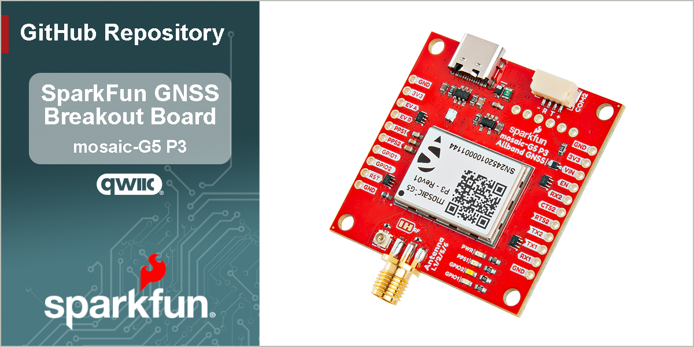

SparkFun Allband GNSS RTK Breakout - mosaic-G5 P3
========================================

[*SparkFun Allband GNSS RTK Breakout - mosaic-G5 P3 (GPS-29208)*](https://www.sparkfun.com/sparkfun-allband-gnss-rtk-breakout-mosaic-g5-p3.html)

This SparkFun Allband GNSS RTK Breakout features the Septentrio mosaic-G5 P3 GNSS module, a 60% smaller and 40% lower power consumption variant of the mosaic-X5 GNSS module, making it ideal for drone and IoT applications. The receiver supports the GPS (USA), GLONASS (Russia), Beidou (China), Galileo (Europe), and QZSS (Japan) GNSS constellations, including regional systems *(i.e. SBAS)*. With its Real-Time Kinematics (RTK) capabilities, the module can achieve a horizontal accuracy of 6mm (~0.25in), vertical accuracy of 1cm (~0.4in), PPS timing resolution of 1.4ns (1.4 billionths of a second), and event trigger accuracy below 3ns. It also features Septentrio's unique [AIM+ technology](https://www.septentrio.com/en/learn-more/advanced-positioning-technology/aim-jamming-protection) for interference mitigation and anti-spoofing, ensuring best-in-class reliability and scalable position accuracy.

The mosaic-G5 P3 GNSS module supports USB 2.0 communication and two UART interfaces; along with two GPIO, two configurable PPS outputs, and two event trigger input pins. Users can control and configure the GNSS module through a command-line interface (CLI) using the Septentrio Binary Format (SBF), NMEA, and RTCM v3.x protocols. Otherwise, users can also configure the GNSS module with Septentrio's [RxTools software application](https://www.septentrio.com/en/products/gps-gnss-receiver-software/rxtools). On the board, the `UART2` interface is also broken out to a locking JST connector and BlueSMiRF PTH header pins to attach an RF transceiver for RTK corrections.

Documentation
-------------

- **[Hookup Guide (mkdocs)](http://docs.sparkfun.com/SparkFun_GNSS_mosaic-G5_P3/)** - A hookup guide for the SparkFun mosaic-G5 P3 GNSS breakout board hosted by GitHub pages. 
   

Repository Contents
-------------------

- **[/docs](/docs/)** - Online documentation files
  - [/assets](/docs/assets/) - Assets files
    - [/3d_model](/docs/assets/3d_model/) - 3D models for the board
    - [/board_files](/docs/assets/board_files/) - Design files for the board
      - [KiCad Design Files](/docs/assets/board_files/kicad_files.zip) (.zip)
      - [Schematic](/docs/assets/board_files/schematic.pdf) (.pdf)
      - [Dimensions](/docs/assets/board_files/dimensions.pdf) (.pdf)
    - [/component_documentation](/docs/assets/component_documentation/) - Datasheets for hardware components
    - [/img/hookup_guide](/docs/assets/img/hookup_guide/) - Images for hookup guide documentation - Hookup guide images for the board
    - /Hardware - Hardware design files (.brd, .sch)
      - /Production - Production files

Product Variants
----------------

- mosaic-G5 P3:
  - [GPS-29208](https://www.sparkfun.com/sparkfun-allband-gnss-rtk-breakout-mosaic-g5-p3.html) - Allband GNSS RTK Breakout - mosaic-G5 P3
  - Flex Modules:
    - [GPS-29209](https://www.sparkfun.com/sparkpnt-gnss-flex-module-mosaic-g5-p3.html) - GNSS Flex module - mosaic-G5 P3
    - [GPS-29363](https://www.sparkfun.com/sparkpnt-gnss-flex-module-mosaic-g5-p3-im19-imu.html) - GNSS Flex module - mosaic-G5 P3 & IM19
    - [GPS-](https://www.sparkfun.com/sparkfun-gnss-flex-phat-mosaic-g5-p3.html) - GNSS Flex pHAT w/ the mosaic-G5 P3 GNSS Flex module
    - [GPS-](https://www.sparkfun.com/sparkfun-gnss-flex-phat-mosaic-g5-p3-im19-imu.html) - GNSS Flex pHAT w/ the mosaic-G5 P3 & IM19 GNSS Flex module
- mosaic-X5:
  - [GPS-23088](https://www.sparkfun.com/sparkfun-triband-gnss-rtk-breakout-mosaic-x5.html) - Triband GNSS RTK Breakout - mosaic-X5
  - [GPS-23748](https://www.sparkfun.com/sparkfun-rtk-mosaic-x5.html) - RTK mosaic-X5
  - [GPS-24903](https://www.sparkfun.com/sparkpnt-rtk-facet-mosaic-l-band.html) - SparkPNT RTK Facet mosaic L-Band
  - Flex Modules:
    - [GPS-28138](https://www.sparkfun.com/sparkpnt-gnss-flex-module-mosaic-x5.html) - GNSS Flex module - mosaic-X5
    - [GPS-29457](https://www.sparkfun.com/sparkpnt-gnss-flex-module-mosaic-x5-im19-imu.html) - GNSS Flex module - mosaic-X5 & IM19
    - [GPS-28766](https://www.sparkfun.com/sparkfun-gnss-flex-phat-mosaic-x5.html) - GNSS Flex pHAT w/ the mosaic-X5 GNSS Flex module
    - [GPS-29889](https://www.sparkfun.com/sparkfun-gnss-flex-phat-mosaic-x5-im19-imu.html) - GNSS Flex pHAT w/ the mosaic-X5 & IM19 GNSS Flex module
- mosaic-T:
  - [GPS-28731](https://www.sparkfun.com/sparkfun-timing-gnss-breakout-mosaic-t.html) - mosaic-T Timing GNSS Breakout
  - [GPS-26289](https://www.sparkfun.com/sparkpnt-gnss-disciplined-oscillator.html) - GNSS Disciplined Oscillator

|                     | mosaic-G5 P3 | mosaic-X5 | mosaic-T |
| :------------------ | :----------- | :-------- | :------- |
| Breakout Board      | [GPS-29208](https://www.sparkfun.com/sparkfun-allband-gnss-rtk-breakout-mosaic-g5-p3.html) | [GPS-23088](https://www.sparkfun.com/sparkfun-triband-gnss-rtk-breakout-mosaic-x5.html) | [GPS-28731](https://www.sparkfun.com/sparkfun-timing-gnss-breakout-mosaic-t.html) |
| GNSS Flex Module         | [GPS-29209](https://www.sparkfun.com/sparkpnt-gnss-flex-module-mosaic-g5-p3.html) [GPS-30384](https://www.sparkfun.com/sparkfun-gnss-flex-phat-mosaic-g5-p3.html) - pHAT Kit | [GPS-28138](https://www.sparkfun.com/sparkpnt-gnss-flex-module-mosaic-x5.html) [GPS-28766](https://www.sparkfun.com/sparkfun-gnss-flex-phat-mosaic-x5.html) - pHAT Kit | N/A |
| GNSS Flex Module w/ IM19 | [GPS-29363](https://www.sparkfun.com/sparkpnt-gnss-flex-module-mosaic-g5-p3-im19-imu.html) [GPS-30546](https://www.sparkfun.com/sparkfun-gnss-flex-phat-mosaic-g5-p3-im19-imu.html) - pHAT Kit | [GPS-29457](https://www.sparkfun.com/sparkpnt-gnss-flex-module-mosaic-x5-im19-imu.html) [GPS-29889](https://www.sparkfun.com/sparkfun-gnss-flex-phat-mosaic-x5-im19-imu.html) - pHAT Kit | N/A |
| Other               | N/A | [GPS-23748](https://www.sparkfun.com/sparkfun-rtk-mosaic-x5.html) - RTK Platform [GPS-24903](https://www.sparkfun.com/sparkpnt-rtk-facet-mosaic-l-band.html) - Facet | [GPS-26289](https://www.sparkfun.com/sparkpnt-gnss-disciplined-oscillator.html) - GNSSDO |

Version History
---------------

- [v10](https://github.com/sparkfun/SparkFun_GNSS_mosaic-G5_P3/releases/tag/v10) - Initial Release

License Information
-------------------

This product is ***open source***!

Please review the [`LICENSE.md`](./LICENSE.md) file for license information.

If you have any questions or concerns about licensing, please contact technical support on our [SparkFun forums](https://community.sparkfun.com/).

Distributed as-is; no warranty is given.

- Your friends at SparkFun.
