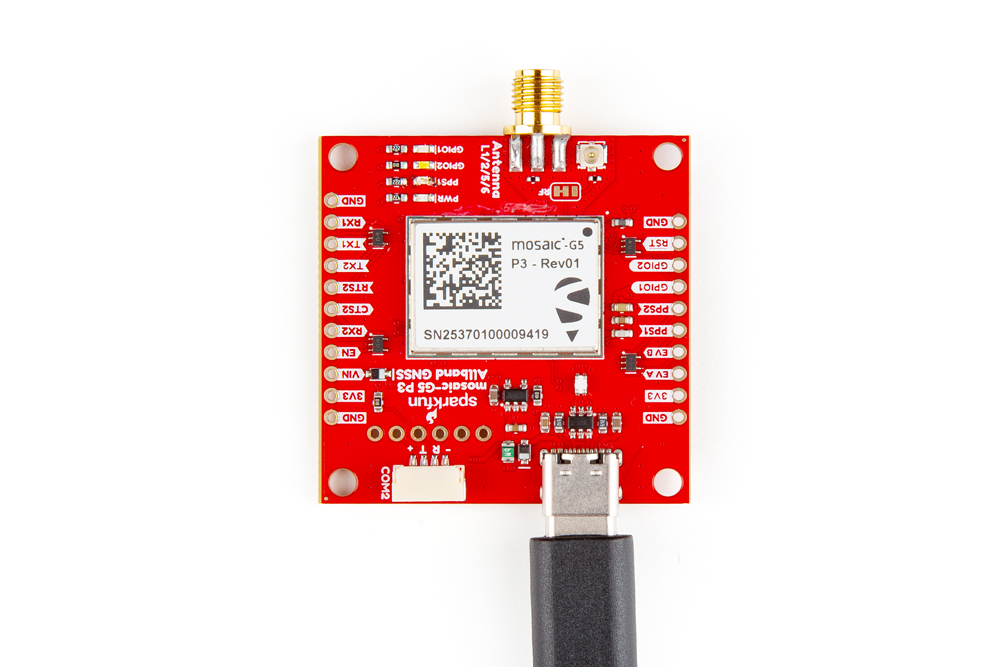
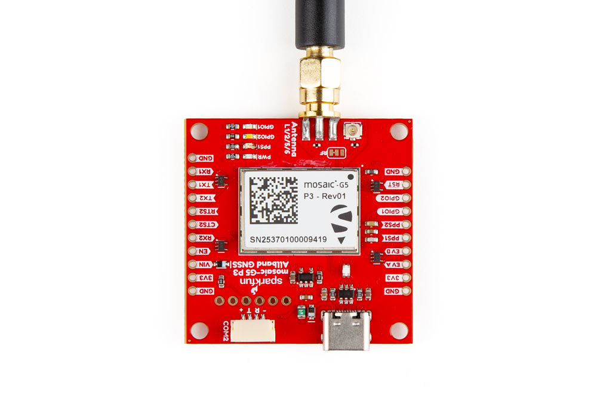
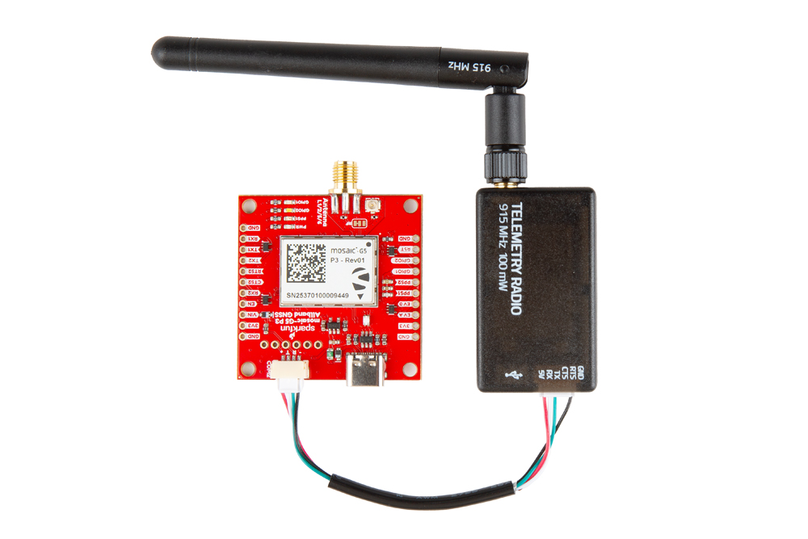
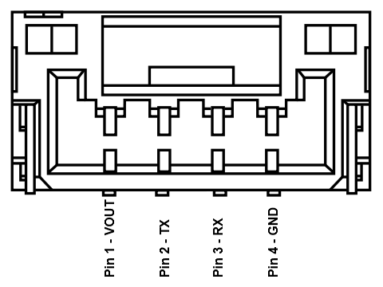
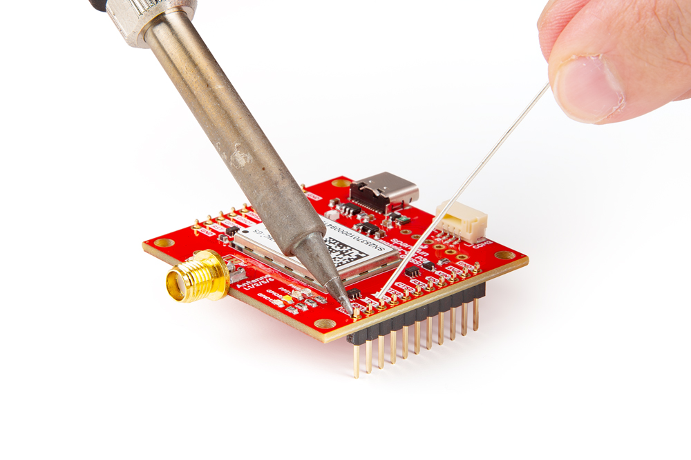
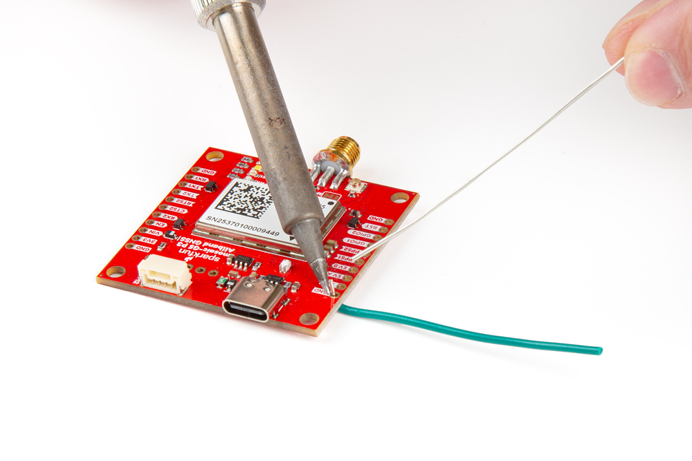
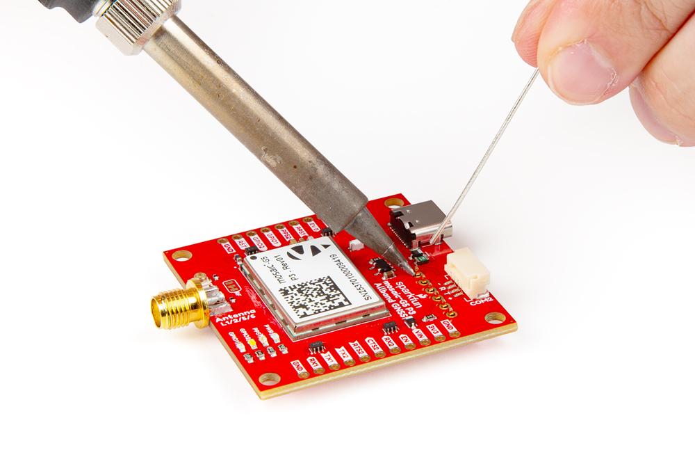
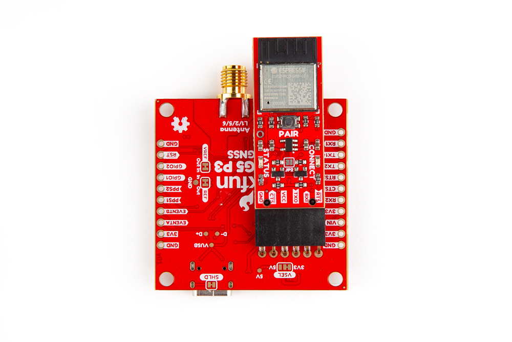

??? danger "Important: Read Before Use!"
	!!! warning "ESD Sensitivity"
		The mosaic-G5 P3 GNSS receiver is sensitive to [ESD](https://en.wikipedia.org/wiki/Electrostatic_discharge "Electrostatic Discharge"). Use a proper grounding system to make sure that the working surface and the components are at the same electric potential.

		??? info
			As recommended by the manufacturer, we highly recommend that users take the necessary precautions to avoid damaging their GNSS receiver.

			- The All-band GNSS RTK breakout board features ESD protection on the USB-C connector and breakout's I/O:
				- USB data lines
				- I/O PTH pads
				- JST connector and BlueSMiRF header pins
			- The mosaic-G5 P3 GNSS receiver features internal ESD protection to the `ANT_1` antenna input.

			

			<article class="video-500px" style="margin: auto;" markdown>
			<iframe src="https://www.youtube.com/embed/hrL5J6Q5gX8?si=jOPBat8rzMnL7Uz4&amp;start=26;&amp;end=35;" title="Septentrio: Getting Started Video (playback starts at ESD warning)" frameborder="0" allow="accelerometer; autoplay; clipboard-write; encrypted-media; gyroscope; picture-in-picture" allowfullscreen></iframe>
			</article>

			

	!!! warning "Active Antenna"
		Never inject an external DC voltage into the SMA connector for the GNSS antenna, as it may damage the mosaic-G5 P3 GNSS receiver. For instance, when using a splitter to distribute the antenna signal to several GNSS receivers, make sure that no more than one output of the splitter passes DC. Use [DC-blocks](https://en.wikipedia.org/wiki/DC_block) otherwise.

## USB Programming
The USB connection is utilized for programming and serial communication. Users only need to plug their All-band GNSS RTK breakout board into a computer using a USB-C cable.

<figure markdown>
[{ width="400" }](./assets/img/hookup_guide/assembly-usb.jpg "Click to enlarge")
<figcaption markdown>The All-band GNSS RTK breakout board with a USB-C cable attached.</figcaption>
</figure>

!!! info
	Once connected to a computer, the mosaic-G5 P3 module emulates two virtual `COM` ports. These can be used as standard `COM` ports to communicate with the GNSS receiver.

## GNSS Antenna
In order to receive [GNSS](https://en.wikipedia.org/wiki/Satellite_navigation "Global Navigation Satellite System") signals, users will need to connect a compatible antenna. For the best performance, we recommend users choose an active, L1/L2/L5/L6 GNSS antenna and utilize a low-loss cable.

<figure markdown>
[{ width="400" }](./assets/img/hookup_guide/assembly-antenna.jpg "Click to enlarge")
<figcaption markdown>Attaching a GNSS antenna to the SMA connector on the All-band GNSS RTK breakout board.</figcaption>
</figure>

!!! warning "Active Antenna"
	Never inject an external DC voltage into the SMA connector for the GNSS antenna, as it may damage the mosaic-G5 P3 GNSS receiver. For instance, when using a splitter to distribute the antenna signal to several GNSS receivers, make sure that no more than one output of the splitter passes DC. Use [DC-blocks](https://en.wikipedia.org/wiki/DC_block) otherwise.

!!! tip
	Don't forget that GNSS signals are fairly weak and can't penetrate buildings or dense vegetation. The GNSS antenna should have an unobstructed view of the sky.

## JST Connector
The JST connector on the All-band GNSS RTK board, breaks out the `COM2` UART port of the mosaic-G5 P3 GNSS receiver. In most circumstances, users will utilize the JST connector to interface with one of our [radio transceivers](https://www.sparkfun.com/sik-telemetry-radio-v3-915mhz-100mw.html) for RTK correction data.

<figure markdown>
[{ width="400" }](./assets/img/hookup_guide/assembly-jst_connector.jpg "Click to enlarge")
<figcaption markdown>Connecting a cable to the JST connector of the All-band GNSS RTK breakout board.</figcaption>
</figure>

!!! info "Pin Connections"
	When connecting the All-band GNSS RTK breakout board to our radios, only the `RX`, `TX`, and `GND` connections are required as outlined in the table below. By default, flow control is disabled on the mosaic-G5 P3 GNSS receiver and the connections are not available through the JST connector.

	<article style="text-align: center;" markdown>

	<table markdown>
	<tr>
	<th>Board</th>
	<td align="center">RX</td>
	<td align="center">TX</td>
	<td align="center">GND</td>
	</tr>
	<tr>
	<th>Radio</th>
	<td align="center">TX</td>
	<td align="center">RX</td>
	<td align="center">GND</td>
	</tr>
	</table>

	</article>

	### All-band GNSS RTK Breakout Board
	When connecting the All-band GNSS RTK breakout board to other products, users need to be aware of the pin connections between the devices.  and voltage ranges of the products. Below, is a table of the pin connections for the JST connector on the All-band GNSS RTK breakout board.

	

	

	<figure markdown>
	[{ width="250" }](./assets/img/hookup_guide/jst_pinout.png "Click to enlarge")
	<figcaption markdown>The pin connections of the JST connector.</figcaption>
	</figure>

	

	

	<article style="text-align: center;" markdown>

	<table border="1" markdown>
	<tr>
	<th style="vertical-align:middle;">Pin Number</th>
	<td align="center">
		**1** 
		*(Left Side)*
	</td>
	<td align="center">**2**</td>
	<td align="center">**3**</td>
	<td align="center" markdown>
		**4** 
		*(Right Side)*
	</td>
	</tr>
	<tr>
	<th>Label</th>
	<td align="center">`+`</td>
	<td align="center">`T`</td>
	<td align="center">`R`</td>
	<td align="center">`-`</td>
	</tr>
	<tr>
	<th style="vertical-align:middle;">Function</th>
	<td>
		<u>**Voltage Output**</u> 
		- **Default: 3.3V** 
		- Selectable: 3.3V or 5V
	</td>
	<td align="center" style="vertical-align:middle;">`UART2` - Transmit</td>
	<td align="center" style="vertical-align:middle;">`UART2` - Receive</td>
	<td align="center" style="vertical-align:middle;">Ground</td>
	</tr>
	</table>

	</article>

	

	

	!!! danger "`VSEL` Pin"
		By default, the power pin *(i.e. `+` or Pin 1)* of the JST connector is connected to **3.3V** and configured as a power output. An input voltage can be supplied through the pin; however, users should be mindful of any voltage contention issues.

		???+ tip "Jumper"
			By default, the [`VSEL` jumper](#jumpers) is connected to `3V3` pad for a regulated 3.3V output. However, users can modify the jumper to utilize the voltage supplied from either the USB or `VIN` inputs.

	### LoRa Radios
	As documented in the [LoRaSerial product manual](https://docs.sparkfun.com/SparkFun_LoRaSerial), the pin connections between a host system *(i.e. All-band GNSS RTK breakout board)* and the LoRaSerial Kit radio is outlined in the image below.

	<figure markdown>
	[{ width="400" }](https://docs.sparkfun.com/SparkFun_LoRaSerial/img/SAMD21%20Flow%20control.png "Click to enlarge")
	<figcaption markdown>The connections for  the LoRaSerial radio to a host system.</figcaption>
	</figure>

	Below, is a table of the pin connections for the JST connector on our radios.

	<article style="text-align: center;" markdown>

	<table border="1" markdown>
	<tr>
	<th style="vertical-align:middle;">Pin Number</th>
	<td align="center">
		**1** 
		*(Left Side)*
	</td>
	<td align="center">**2**</td>
	<td align="center">**3**</td>
	<td align="center">**4**</td>
	<td align="center">**5**</td>
	<td align="center">
		**6** 
		*(Right)*
	</td>
	</tr>
	<tr>
	<th style="vertical-align:middle;">Label</th>
	<td align="center" style="vertical-align:middle;">5V</td>
	<td>
		RX - SiK 
		RXI - LoRaSerial
	</td>
	<td>
		TX - SiK 
		TXO - LoRaSerial
	</td>
	<td align="center" style="vertical-align:middle;">CTS</td>
	<td align="center" style="vertical-align:middle;">RTS</td>
	<td align="center" style="vertical-align:middle;">GND</td>
	</tr>
	<tr>
	<th style="vertical-align:middle;">Function</th>
	<td>
		**Voltage Input** 
		- SiK: 5V 
		- LoRaSerial: 3.3 to 5V
	</td>
	<td align="center" style="vertical-align:middle;">UART - Receive</td>
	<td align="center" style="vertical-align:middle;">UART - Transmit</td>
	<td align="center" style="vertical-align:middle;">
		Flow Control 
		*Clear-to-Send*
	</td>
	<td align="center" style="vertical-align:middle;">
		Flow Control 
		*Ready-to-Send*
	</td>
	<td align="center" style="vertical-align:middle;">Ground</td>
	</tr>
	</table>

	</article>

	<!-- Markdown Table (Original)
	| Pin Number | Label              | Function                        |
	| :--------: | :----------------: | :------------------------------ |
	| 1 | V - Allband 5V - Radios  | **Voltage Input** - Allband: 3.5 to 5.5V - SiK: 5V - LoRaSerial: 3.3 to 5V |
	| 2 | RX - Allband/SiK  RXI - LoRaSerial | UART - Receive        |
	| 3 | TX - Allband/SiK  TXO - LoRaSerial | UART - Transmit       |
	| 4 | C - Allband CTS - Radios | Flow Control *Clear-to-Send* |
	| 5 | R - Allband RTS - Radios | Flow Control *Ready-to-Send* |
	| 6 | G - Allband GND - Radios | Ground                          |-->

## Breakout Pins
The [PTH](https://en.wikipedia.org/wiki/Through-hole_technology "Plated Through Holes") pins on the All-band GNSS RTK board are broken out into 0.1"-spaced pins on the outer edges of the board.

??? note "New to soldering?"
	If you have never soldered before or need a quick refresher, check out our [How to Solder: Through-Hole Soldering](https://learn.sparkfun.com/tutorials/how-to-solder-through-hole-soldering) guide.

	

	-   <a href="https://learn.sparkfun.com/tutorials/5">
		<figure markdown>
		
		</figure>

		---

		**How to Solder: Through-Hole Soldering**</a>

	

### Headers
When selecting headers, be sure you are aware of the functionality you require.

<figure markdown>
[{ width="400" }](./assets/img/hookup_guide/assembly-headers.jpg "Click to enlarge")
<figcaption markdown>Soldering headers to the All-band GNSS RTK breakout board.</figcaption>
</figure>

### Hookup Wires
For a more permanent connection, users can solder wires directly to the board.

<figure markdown>
[{ width="400" }](./assets/img/hookup_guide/assembly-wires.jpg "Click to enlarge")
<figcaption markdown>Soldering wires to the All-band GNSS RTK breakout board.</figcaption>
</figure>

---

### BlueSMiRF Header
To pair the All-band GNSS RTK breakout board with a mobile device, users will need to connect a [BlueSMiRF v2](https://www.sparkfun.com/sparkfun-bluesmirf-v2-headers.html) to the available header pins.

<figure markdown>
[{ width="400" }](./assets/img/hookup_guide/assembly-headers-bluesmirf.jpg "Click to enlarge")
<figcaption markdown>Soldering headers to the All-band GNSS RTK breakout board.</figcaption>
</figure>

<figure markdown>
[{ width="400" }](./assets/img/hookup_guide/assembly-bluesmirf.jpg "Click to enlarge")
<figcaption markdown>Connecting a BlueSMiRF v2 to female headers soldered on the All-band GNSS RTK breakout board.</figcaption>
</figure>

