??? danger "Important: Read Before Use!"
	!!! warning "ESD Sensitivity"
		The mosaic-G5 P3 GNSS receiver is sensitive to [ESD](https://en.wikipedia.org/wiki/Electrostatic_discharge "Electrostatic Discharge"). Use a proper grounding system to make sure that the working surface and the components are at the same electric potential.

		??? info
			As recommended by the manufacturer, we highly recommend that users take the necessary precautions to avoid damaging their GNSS receiver.

			- The All-band GNSS RTK breakout board features ESD protection on the USB-C connector and breakout's I/O:
				- USB data lines
				- I/O PTH pads
				- JST connector and BlueSMiRF header pins
			- The mosaic-G5 P3 GNSS receiver features internal ESD protection to the `ANT_1` antenna input.

			

			<article class="video-500px" style="margin: auto;" markdown>
			<iframe src="https://www.youtube.com/embed/hrL5J6Q5gX8?si=jOPBat8rzMnL7Uz4&amp;start=26;&amp;end=35;" title="Septentrio: Getting Started Video (playback starts at ESD warning)" frameborder="0" allow="accelerometer; autoplay; clipboard-write; encrypted-media; gyroscope; picture-in-picture" allowfullscreen></iframe>
			</article>

			

	!!! warning "Active Antenna"
		Never inject an external DC voltage into the SMA connector for the GNSS antenna, as it may damage the mosaic-G5 P3 GNSS receiver. For instance, when using a splitter to distribute the antenna signal to several GNSS receivers, make sure that no more than one output of the splitter passes DC. Use [DC-blocks](https://en.wikipedia.org/wiki/DC_block) otherwise.

## :material-folder-cog: Design Files
<!-- Import the component -->

-   :kicad-primary:{ .enlarge-logo } Design Files

	---

	- :fontawesome-solid-file-pdf: [Schematic](./assets/board_files/schematic.pdf)
	- :material-folder-zip: [KiCad Files](./assets/board_files/kicad_files.zip)
	- :material-rotate-3d: [STEP File](./assets/3d_model/cad_model.step)
	- :fontawesome-solid-file-pdf: [Board Dimensions](./assets/board_files/dimensions.pdf):
		- 1.70" x 1.70" (43.2mm x 43.2mm)

-   <!-- Boxes in tabs -->

	=== "3D Model"
		<article style="text-align: center;" markdown>
		<model-viewer src="../assets/3d_model/web_model.glb" camera-controls poster="../assets/3d_model/poster.png" tone-mapping="neutral" shadow-intensity="2" shadow-softness="0.2" camera-orbit="0deg 75deg 0.103m" field-of-view="25.11deg" style="width: 100%; height: 450px;">
		</model-viewer>

		[Download the `*.step` File](./assets/3d_model/cad_model.step "Click download"){ .md-button .md-button--primary width="250px" }

		</article>

		???+ tip "Manipulate 3D Model"
			<article style="text-align: center;" markdown>

			| Controls       | Mouse                    | Touchscreen    |
			| :------------- | :----------------------: | :------------: |
			| Zoom           | Scroll Wheel             | 2-Finger Pinch |
			| Rotate         | ++"Left-Click"++ & Drag  | 1-Finger Drag  |
			| Move/Translate | ++"Right-Click"++ & Drag | 2-Finger Drag  |

			</article>

	=== "Dimensions"
		<article style="text-align: center;" markdown>
		[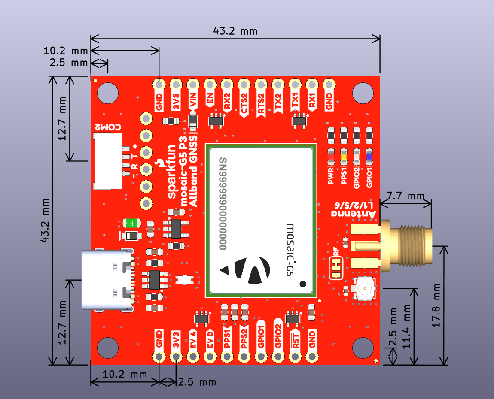{ width="450" }](./assets/board_files/dimensions.png "Click to enlarge")
		<figcaption markdown>Dimensions of the mosaic-G5 P3 GNSS breakout board.</figcaption>
		</article>

		???+ tip "Need more measurements?"
			For more information about the board's dimensions, users can download the [KiCad files](./assets/board_files/kicad_files.zip) for this board. These files can be opened in KiCad and additional measurements can be made with the measuring tool.

			!!! info ":octicons-download-16:{ .heart } KiCad - Free Download!"
				KiCad is free, open-source [CAD]("computer-aided design") program for electronics. Click on the button below to download their software. *(\*Users can find out more information about KiCad from their [website](https://www.kicad.org/).)*

				<article style="text-align: center;" markdown>
				[Download :kicad-primary:{ .enlarge-logo }](https://www.kicad.org/download/ "Go to downloads page"){ .md-button .md-button--primary width="250px" }
				</article>

			???+ info ":straight_ruler: Measuring Tool"
				This video demonstrates how to utilize the dimensions tool in KiCad, to include additional measurements:

				<article class="video-500px" style="text-align: center; margin: auto;" markdown>
				<iframe src="https://www.youtube.com/embed/-eXuD8pkCYw" title="KiCad Dimension Tool" frameborder="0" allow="accelerometer; autoplay; clipboard-write; encrypted-media; gyroscope; picture-in-picture" allowfullscreen></iframe>
				{ .qr width="85" }
				</article>

## Board Layout
The SparkFun Allband GNSS RTK Breakout - mosaic-G5 P3 features the following:

<figure markdown>
[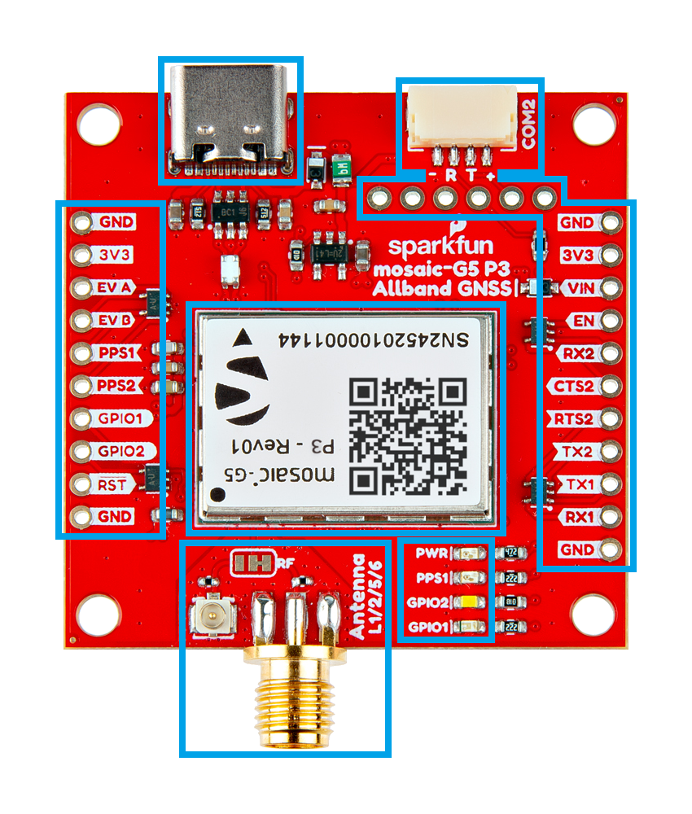{ width="500" }](./assets/img/hookup_guide/layout.png "Click to enlarge")
<figcaption markdown>Layout of the major components on the breakout board.</figcaption>
</figure>

1. **[USB-C Connector](#usb-c-connector)**
:   The primary inteface for powering and interacting with the board
1. **[mosaic-G5 P3 GNSS Receiver](#mosaic-g5-p3)**
:   The Septentrio mosaic-G5 P3 GNSS receiver
1. **Header Pins**
:   Exposes pins to [power the board](#power) and breaks out the [interfaces of the mosaic-G5 P3 GNSS receiver](#peripherals-and-io-pins)
1. **[BlueSMiRF Header Pins](#bluesmirf-header)**
:   Exposes the `UART2` interface of the mosaic-G5 P3 GNSS receiver
1. **[JST Connector](#jst-connector)**
:   Exposes the `UART2` interface of the mosaic-G5 P3 GNSS receiver
1. **[Status LEDs](#status-leds)**
:   LED status indicators for the mosaic-G5 P3 GNSS receiver
1. **[`Antenna L1/2/5/6` RF Connectors](#antenna-connections)**
:   SMA and U.FL *(optional)* connectors for an external GNSS antenna

## USB-C Connector
The USB connector is provided to power and interface with the mosaic-G5 P3 GNSS receiver. For most users, it will be the primary method for communicating with the GNSS receiver.

<figure markdown>
[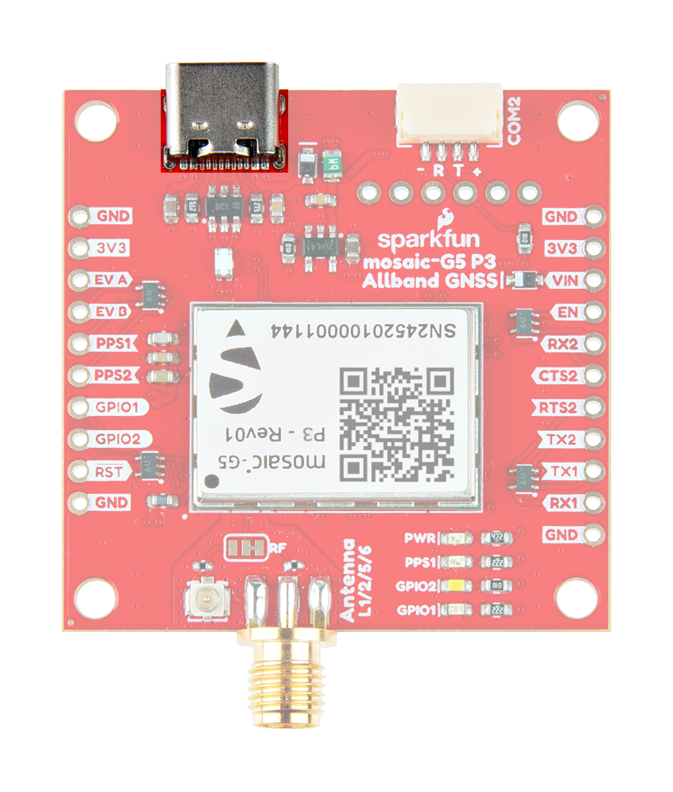{ width="400" }](./assets/img/hookup_guide/usb_connector.png "Click to enlarge")
<figcaption markdown>USB-C connector on the All-band GNSS RTK breakout board.</figcaption>
</figure>

## Power
The All-band GNSS RTK breakout board only requires **3.3V** to power all of the board's components. The simplest method to power the board is through the USB-C connector. Alternatively, the board can also be powered through the **`VIN`** pin.

<figure markdown>
[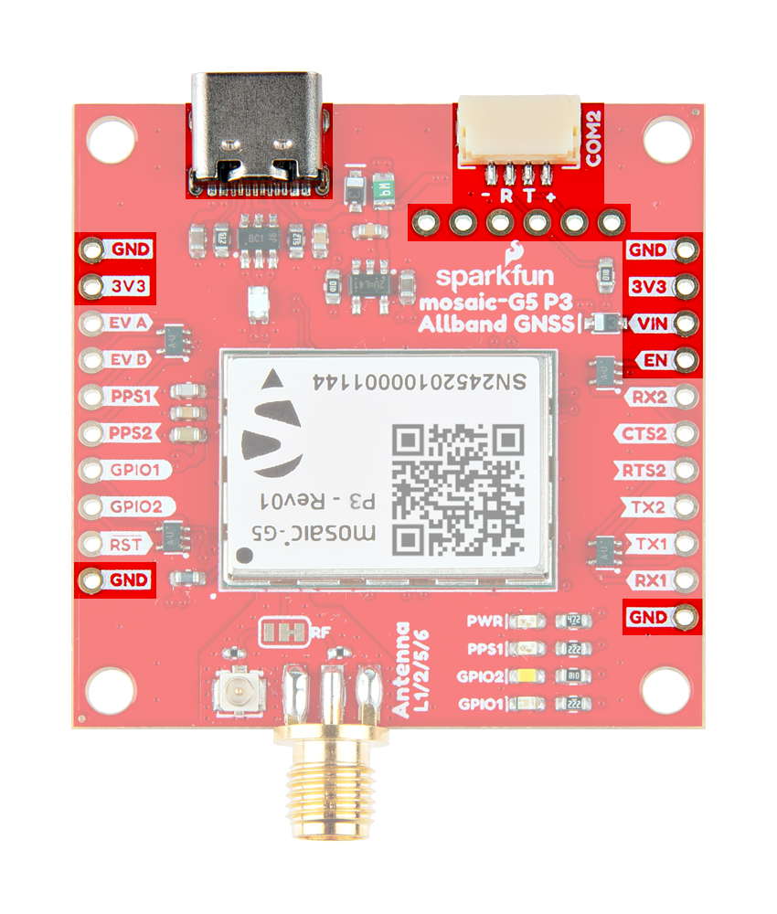{ width="400" }](./assets/img/hookup_guide/power_connections.png "Click to enlarge")
<figcaption markdown>All-band GNSS RTK breakout board's power connections.</figcaption>
</figure>

Below, is a general summary of the power circuitry on the board, broken out as [PTH](https://en.wikipedia.org/wiki/Through-hole_technology "Plated Through Holes") pins:

- **`VUSB`** - The voltage from the USB-C connector, usually **5V**
	- Input Voltage Range: 4.4 - 5.5 V
	- Power source for the entire board
		- Powers the 3.3V voltage regulator (RT9080), which can source up to 600mA
		- When enabled, it can also power the [BlueSMiRF header](#bluesmirf-header) and [JST connector](#jst-connector) *(see the **[Jumpers](#jumpers)** section)*
- **`VIN`** - Alternate input supply voltage for the board
	- Input Voltage Range: 1.2 - 5.5V (1)
	- Power source for the entire board
		- Powers the 3.3V voltage regulator (RT9080), which can source up to 600mA
		- When enabled, it can also power the [BlueSMiRF header](#bluesmirf-header) and [JST connector](#jst-connector) *(see the **[Jumpers](#jumpers)** section)*
- **`3V3`** - Provides a regulated 3.3V from the [RT9080](./assets/component_documentation/RT9080.pdf), using the power supplied from the `VIN` pin or USB-C connector
	- Used to power the mosaic-G5 P3 GNSS receiver and its active antenna preamplifier, the LEDs, and the power pin of the [JST connector](#jst-connector) and [BlueSMiRF header](#bluesmirf-header)
	- Controlled by the `EN` pin, which is enabled by default
- **`EN`** - Enables the voltage output from the [RT9080](./assets/component_documentation/RT9080.pdf), 3.3V voltage regulator
	- Enabled by default *(active `HIGH`)*
- **`RST`** - Used to reset the mosaic-G5 P3 GNSS receiver
	- Connected to the `nRST_IN` input-only pin with an internal pull-up resistor
	- Driving the pin `LOW` triggers the restart of the mosaic-G5 P3 GNSS receiver
- **`GND`** - The common ground or the 0V reference for the voltage supplies.

1. While the [RT9080](./assets/component_documentation/RT9080.pdf) LDO regulator has an input voltage range of 1.2 - 5.5V, a minimum supply voltage of **3.5V** is recommended for a 3.3V output.

!!! tip "JST Connector"
	The `VSEL` pin of the [BlueSMiRF header](#bluesmirf-header) and `+` pin of the [JST connector](#jst-connector) are designed to operate as a voltage output. An input voltage can be supplied through these pins; however, users should be mindful of any voltage contention issues. Additionally, users can modify the [`VSEL` jumper](#jumpers) to change the output voltage level of these pins.

!!! info
	For more details, users can reference the [schematic](./assets/board_files/schematic.pdf) and the datasheets of the individual components on the board.

### Power Consumption
The power consumption of the mosaic-G5 P3 GNSS receiver depends on the GNSS signals enabled and the positioning mode. The table below, lists the average power consumption for common configurations. The current listed, is based on a supply voltage of 3.3V.

<article style="text-align: center;" markdown>

| GNSS Signals | Power (mW) | Current (mA) |
| :----------- | :--------: | :----------: |
| GPS/GLONASS L1/L2 | 440 | 133 |
| All signals from all GNSS constellations | 570 | 173 |
| All signals from all GNSS constellations +L-band | 670 | 203 |

*Source: [mosaic-G5 P3 Hardware Manual](./assets/component_documentation/mosaic-g5_hardware_manual_v1.1.1.pdf)*
</article>

## :fontawesome-solid-microchip:&nbsp; mosaic-G5 P3
The centerpiece of the All-band GNSS RTK breakout board, is the [mosaic-G5 P3 GNSS receiver](./assets/component_documentation/mosaic-g5_hardware_manual_v1.1.1.pdf) from [Septentrio](https://www.septentrio.com/en). Their mosaic-G5 P3 modules are low-power, multi-band, multi-constellation GNSS receivers capable of delivering centimeter-level precision in a small form factor without compromising on performance. They provide strong positioning reliability in challenging environments and are tailored for applications such as delivery or light show drones. It also features Septentrio's unique [AIM+ technology](https://www.septentrio.com/en/learn-more/advanced-positioning-technology/aim-resilient-and-secure-gnss/gps-receivers) for interference mitigation and anti-spoofing, which ensures their best-in-class reliability and scalable position accuracy.

<article class="video-500px" style="margin: auto;" markdown>
<iframe src="https://www.youtube.com/embed/3VzVxTTvF5Q" title="Septentrio mosaic range: high-accuracy GNSS receivers for drones &amp; robotics" frameborder="0" allow="accelerometer; autoplay; clipboard-write; encrypted-media; gyroscope; picture-in-picture" allowfullscreen></iframe>
{ .qr }
</article>

-   <figure markdown>
	[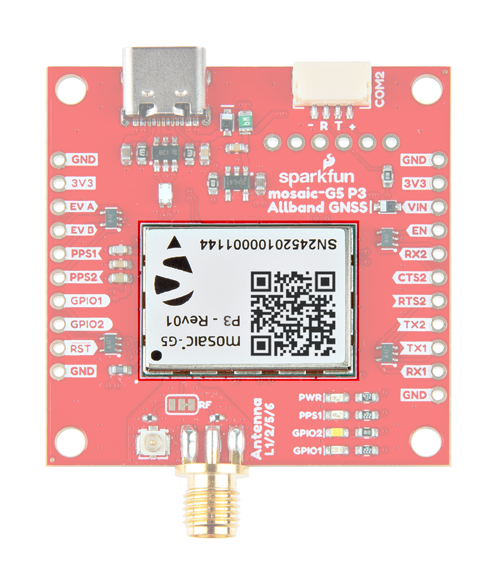{ width="400" }](./assets/img/hookup_guide/mosaic-G5_P3.png "Click to enlarge")
	<figcaption markdown>The mosaic-G5 P3 GNSS receiver on the All-band GNSS RTK breakout board.</figcaption>
	</figure>

**Features:**

- Operating Voltage: **3.135 - 3.465V**
- GNSS Support
	- GPS: `L1C/A`, `L1C`, `L2C`, `L2PY`, `L5`
	- GLONASS: `L1CA`, `L2CA`, `L2P`, `L3 CDMA`
	- Beidou: `B1I`, `B1C`, `B2a`, `B2b`, `B2I`, `B3I`
	- Galileo: `E1`, `E5a`, `E5b`, `E6`
	- QZSS: `L1C/A`, `L1 C/B`, `L2C`, `L5`, `L6`
- Time to Fix
	- Cold Start: < 35s
	- Warm: < 10s
	- Reacquisition: 1s
- Position Accuracy
	<article style="text-align: center;" markdown>

	| Correction | Horizontal                             | Vertical                     |
	| :--------- | :------------------------------------: | :--------------------------: |
	| RTK        | **0.6cm** *(&plusmn;0.5ppm)* ~0.25" | 1cm *(&plusmn;1ppm)* ~.4" |
	| DGNSS      | 40cm ~1.3'                          | 70cm ~2.3'                |
	| Standalone | 1.2m ~4'                            | 1.9m ~6.2'                |

	</article>

 

- Update Rate: 20Hz
- Latency: < 10ms
- Event Accuracy: < 3ns
- Interfaces:
	- UART (x2)
	- USB device (2.0, HS)
	- GPIO user programmable (x2)
	- Event markers (x2)
	- Configurable PPS out (x2)
- Protocols:
	- Septentrio Binary Format (SBF)
	- NMEA 0183, v2.3, v3.03, V4.0
	- RTCM v3.x (MSM included)
- Antenna Specifications
	- Preamplification Range: 15-50dB
	- Bias Voltage: 3.0 - 5.5V
	- 789 Hardware Channels
- Operating Temperature: -40 - 85&deg;C
- Package Size: 16.4mm x 22.8mm x 2.4mm
- Weight: 2.2g

!!! tip
	The capabilities of each receiver is defined by a the optional features that are enabled. The capabilities of the receiver depend on a combination of the hardware model and version, the firmware version, and the set of permissions enabled for the optional features. Permissions are further explained in section 1.17. The command `getReceiverCapabilities` will list the receiver's capabilities. Otherwise, using RxControl (go to **Help** > **Receiver Interface** > **Permitted Capabilities**).

### Frequency Bands
The mosaic GNSS receivers are multi-band, multi-constellation GNSS receivers. Below, are charts illustrating the frequency bands utilized by all the global navigation satellite systems and the ones supported by the mosaic-G5 P3 GNSS receiver.

<figure markdown>
[{ width="650" }](./assets/img/hookup_guide/frequency_bands.png "Click to enlarge")
<figcaption markdown>The frequency bands supported by the mosaic-G5 P3 GNSS receiver.</figcaption>
</figure>

<figure markdown>
[{ width="800" }](https://www.tallysman.com/app/uploads/2021/07/Tallysman-GNSS-Frequencies-v8.0_Chart-1-1024x425.png "Click to enlarge")
<figcaption markdown>Frequency bands of the global navigation satellite systems. (Source: [Tallysman](https://www.tallysman.com/gnss-constellations-radio-frequencies-and-signals/))</figcaption>
</figure>

!!! info
	For a comparison of the frequency bands supported by the mosaic GNSS receivers, refer to section **3.1** of the [hardware manual](./assets/component_documentation/mosaic-g5_hardware_manual_v1.1.1.pdf).

	??? info "What are Frequency Bands?"
		A [frequency band](https://en.wikipedia.org/wiki/Frequency_band) is a section of the [electromagnetic spectrum](https://en.wikipedia.org/wiki/Electromagnetic_spectrum), usually denoted by the range of its upper and lower limits. In the [radio spectrum](https://en.wikipedia.org/wiki/Radio_spectrum), these frequency bands are usually regulated by region, often through a government entity. This regulation prevents the interference of RF communication; and often includes major penalties for any interference with critical infrastructure systems and emergency services.

		<figure markdown>
		[{ width="400" }](https://gssc.esa.int/navipedia/images/c/cf/GNSS_All_Signals.png "Click to enlarge")
		<figcaption markdown>Frequency bands of the global navigation satellite systems. (Source: [ESA](https://gssc.esa.int/navipedia/index.php?title=File:GNSS_All_Signals.png "European Space Agency"))</figcaption>
		</figure>

		However, if the various GNSS constellations share similar frequency bands, then how do they avoid interfering with one another? Without going too far into detail, the image above illustrates the frequency bands of each system with a few characteristics specific to their signals. Wit these characteristics in mind, along with other factors, the chart can help users to visualize how multiple GNSS constellations might co-exist with each other.

		For more information, users may find these articles of interest:

		- [GNSS signal](https://gssc.esa.int/navipedia/index.php/GNSS_signal)
		- [GPS Signal Plan](https://gssc.esa.int/navipedia/index.php?title=GPS_Signal_Plan)
		- [GLONASS Signal Plan](https://gssc.esa.int/navipedia/index.php?title=GLONASS_Signal_Plan)
		- [GALILEO Signal Plan](https://gssc.esa.int/navipedia/index.php?title=GALILEO_Signal_Plan)

### Position Accuracy

The accuracy of the position reported from the mosaic-G5 P3 GNSS receiver, can be improved based upon the correction method being employed. Currently, [RTK](https://en.wikipedia.org/wiki/Real-time_kinematic_positioning "Real-Time Kinematic") corrections provide the highest level of accuracy; however, users should be aware of certain limitations of the system:

- RTK technique requires real-time correction data from a reference station or network of base stations.
	- RTK corrections are signal specific *(i.e. an RTK network might provide corrections on only `E5b` and not `E5a`)*.
- The range of the base stations will vary based upon the RTK method being employed.
- The reliability of RTK corrections are inherently reduced in [multipath environments](https://en.wikipedia.org/wiki/Multipath_propagation). However, with Septentrio's multipath mitigation technology ([APME+](https://www.septentrio.com/en/learn-more/Advanced-positioning-technology/gnss-technology/multipath-mitigation-technology "A-Posteriori Multipath Estimation")) on the mosaic-G5 P3, these errors are significantly reduced when compared to multipath mitigation techniques that modify the correlators in the tracking channels.

<article style="text-align: center;" markdown>

| Correction                                                                                    | Horizontal                             | Vertical                     |
| :-------------------------------------------------------------------------------------------- | :------------------------------------: | :--------------------------: |
| [RTK](https://en.wikipedia.org/wiki/Real-time_kinematic_positioning "Real-Time Kinematic")    | **0.6cm** *(&plusmn;0.5ppm)* ~0.25" | 1cm *(&plusmn;1ppm)* ~.4" |
| [DGNSS](https://en.wikipedia.org/wiki/Differential_GPS "Differential GNSS")                   | 40cm ~1.3'                          | 70cm ~2.3'                |
| Standalone                                                                                    | 1.2m ~4'                            | 1.9m ~6.2'                |

</article>

??? info "RTK Corrections"
	To understand how RTK works, users will need a more fundamental understanding of the signal error sources.

	

	-   <a href="https://www.sparkfun.com/news/7533">
		<figure markdown>
		
		</figure>

		---

		**Real-Time Kinematics Explained**</a>

	-   <a href="https://www.sparkfun.com/news/7138">
		<figure markdown>
		
		</figure>

		---

		**What is Correction Data?**</a>

	-   <a href="https://www.septentrio.com/en/learn-more/insights/gnss-corrections-demystified">
		<figure markdown>
		
		</figure>

		---

		**GNSS Corrections Demystified**</a>

	

!!! tip
	For the best performance, we highly recommend that users configure the GNSS receiver to utilize/provide RTK corrections with a compatible L1/L2/L5/L6 (All-band) GNSS antenna and utilize a low-loss cable.

## Peripherals and I/O Pins
The mosaic-G5 P3 features several peripherals and I/O pins. Some of these are broken out as pins on the All-band GNSS RTK breakout board; whereas, others are broken out to their specific interface *(i.e. USB connector, etc.)*. Additionally, some of their connections are tied to other components on the board.

<figure markdown>
[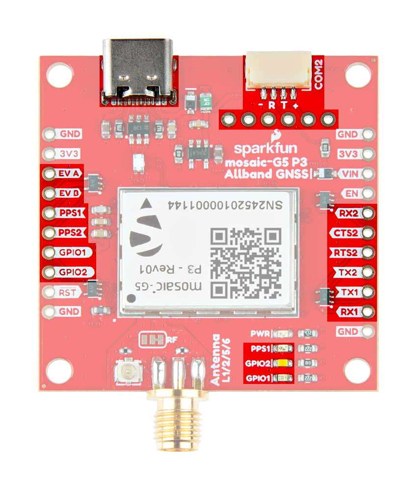{ width="400" }](./assets/img/hookup_guide/peripherals.png "Click to enlarge")
<figcaption markdown>The peripherals and I/O pins on the All-band GNSS RTK breakout board.</figcaption>
</figure>

<article class="annotate" markdown>
**Interfaces:**

- USB device (2.0, HS)
- 2x UART (LVTTL, up to 4 Mbps)
- 2x GPIO user programmable
- 2x Event markers
- 2x Configurable PPS out

</article>

=== "USB"
	For most users, this will be the primary interface for the mosaic-G5 P3 GNSS receiver.

	<figure markdown>
	[{ width="400" }](./assets/img/hookup_guide/usb_connector.png "Click to enlarge")
	<figcaption markdown>USB-C connector on the All-band GNSS RTK breakout board.</figcaption>
	</figure>

	!!! info
		When a GNSS receiver is initially connected to a computer, two virtual `COM` ports are emulated. These can be used as standard `COM` ports to communicate with the GNSS receiver.

=== "UARTs"
	The mosaic-G5 P3 has two dedicated UART interfaces. Each of the UART ports can be configured and operated separately.

	

	

	<figure markdown>
	[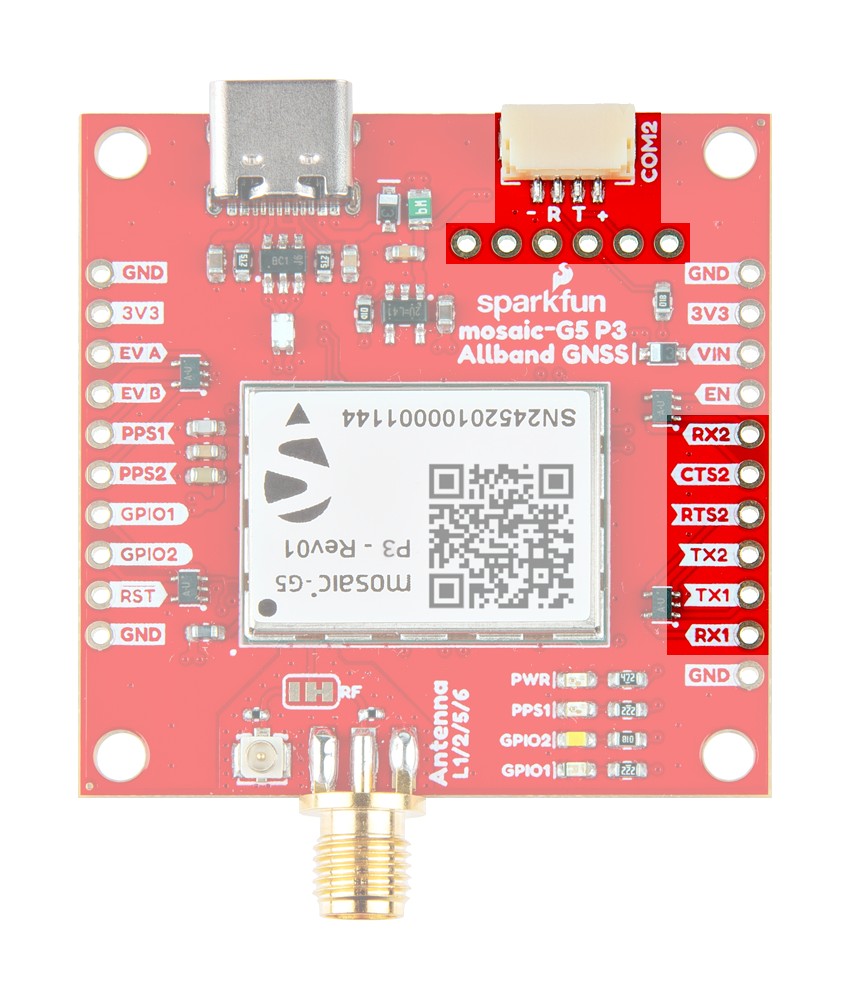{ width="400" }](./assets/img/hookup_guide/uart.png "Click to enlarge")
	<figcaption markdown>The UART ports on the All-band GNSS RTK breakout board.</figcaption>
	</figure>

	

	

	!!! info
		By default, the UART ports are configured with the following settings:

		- Baudrate: 115200bps
		- Data Bits: 8
		- Parity: No
		- Stop Bits: 1
		- Flow Control: None

		The COM port settings are set with the `setCOMSettings` command.

		!!! tip "`UART2`"
			The `UART2` or `COM2` interface features flow control pins, which are disabled by default. The interface can also be accessed through the [JST connector](#jst-connector) and/or [BlueSMiRF header](#bluesmirf-header).

			!!! warning "Bus Contention"
				To avoid [bus contention](https://en.wikipedia.org/wiki/Bus_contention) issues, make sure only one device is connected to any of these options.

	

	

	??? tip "Pin Connections"
		When connecting to the board's UART pins, the pins should be connected based upon the flow of their data. For example, when utilizing the [Telemetry Radio](https://www.sparkfun.com/sik-telemetry-radio-v3-915mhz-100mw.html) or the [LoRaSerial Kit](https://www.sparkfun.com/sparkfun-loraserial-kit-915mhz-enclosed.html):

		<figure markdown>
		[{ width="400" }](https://docs.sparkfun.com/SparkFun_LoRaSerial/img/SAMD21%20Flow%20control.png "Click to enlarge")
		<figcaption markdown>Connection of the UART pins from the [LoRaSerial radio](https://www.sparkfun.com/sparkfun-loraserial-kit-915mhz-enclosed.html) to a host system, like the All-band GNSS RTK breakout board.</figcaption>
		</figure>

=== "PPS Output"
	The 3.3V [PPS](https://en.wikipedia.org/wiki/Pulse-per-second_signal "Pulse Per Second") signals can be access through the `PPSx` pins. The polarity, frequency, and pulse width of these signals can be configured with the `setPPSParameters` and `setPPS2Parameters` commands.

	

	

	<figure markdown>
	[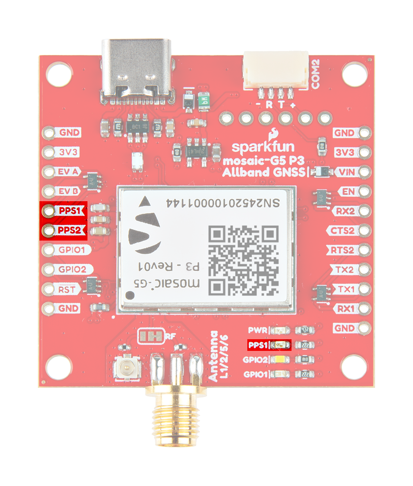{ width="400" }](./assets/img/hookup_guide/pps.png "Click to enlarge")
	<figcaption markdown>The `PPS` signal outputs on the All-band GNSS RTK breakout board.</figcaption>
	</figure>

	

	

	!!! info
		During module startup, these pins are first in high-Z mode for about 1s. Then they are driven low for another second before being driven to the intended user-selected level about 2s after powering up the module.

	!!! tip "GPIO Pins"
		It is possible to use these pins as general-purpose I/O pins, but their maximum current limited to 8mA.

	!!! tip "`PPS1` LED"
		The `PPS1` signal is connected to the `PPS` LED, to be used as a visual indicator. There is also `PPS1` jumper attached to the `PPS` LED. For low power applications, the [jumper](#jumpers) can be cut to disable the `PPS` LED.

	

	

=== "GPIO Pins"
	The mosaic-G5 P3 GNSS receiver features two general purpose I/O pins. These pins have a maximum output current of 16 mA and pulled-up by default. These pins are also connected to the `GPIO1` and `GPIO2` [status LEDs](#status-leds), whose function (level or LED status indicator) can be programmed with the `setGPIO1Mode` and `setGPIO2Mode` commands.

	

	

	<figure markdown>
	[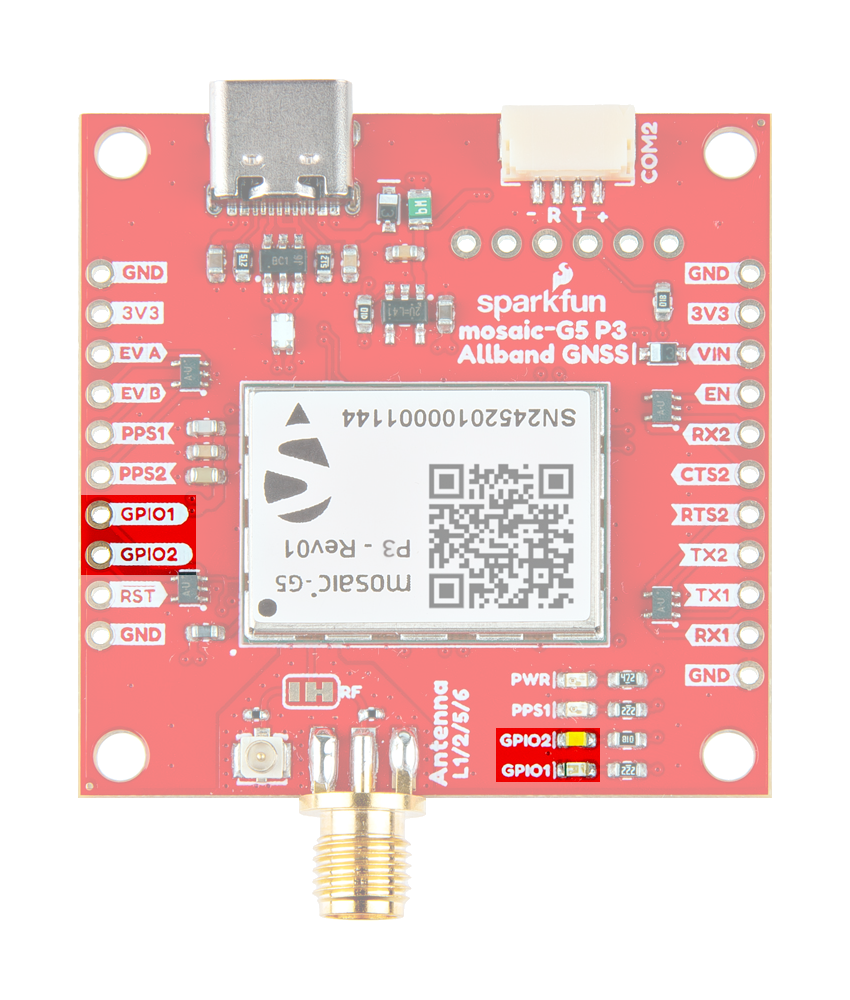{ width="400" }](./assets/img/hookup_guide/gpio.png "Click to enlarge")
	<figcaption markdown>The GPIO pins and LEDs on the All-band GNSS RTK breakout board.</figcaption>
	</figure>

	

	

	Along with its polarity, the output signal from these pins can be used to indicate one of the following [status modes](#status-leds):

	- `PVTLED`: LED lights when a PVT solution is available.
	- `RTKLED`: LED is off if the PVT is not in RTK mode, blinks in float RTK and is solid on in fixed RTK.
	- `TRACKLED`: Tracked satellite indicator.
	- `DIFFCORRLED`: Differential correction indicator.
		- In rover PVT mode, this LED reports the number of satellites for which differential corrections have been provided in the last received differential correction message (RTCM or CMR).
		- If the corrections are received from geostationary satellites over the L-band, the LED will be on for about 1 second, then blink fast twice.

	!!! info
		By default, these pins are configured in input mode with pull-up. Also, for about 2 seconds after powering or resetting the module, these pins are in input mode (pulled up) regardless of the user configuration stored in the boot configuration file.

	!!! tip "LED Jumpers"
		There are jumpers attached to the `GPIOx` LEDs. For low power applications, the [jumpers](#jumpers) can be cut to disable their respective LED.

	

	

=== "Event Pins"
	The mosaic-G5 P3 GNSS receiver features two event input pins, which can be used to time tag external events with a time resolution of 3ns. Use the `setEventParameters` command to configure these pins.

	

	

	<figure markdown>
	[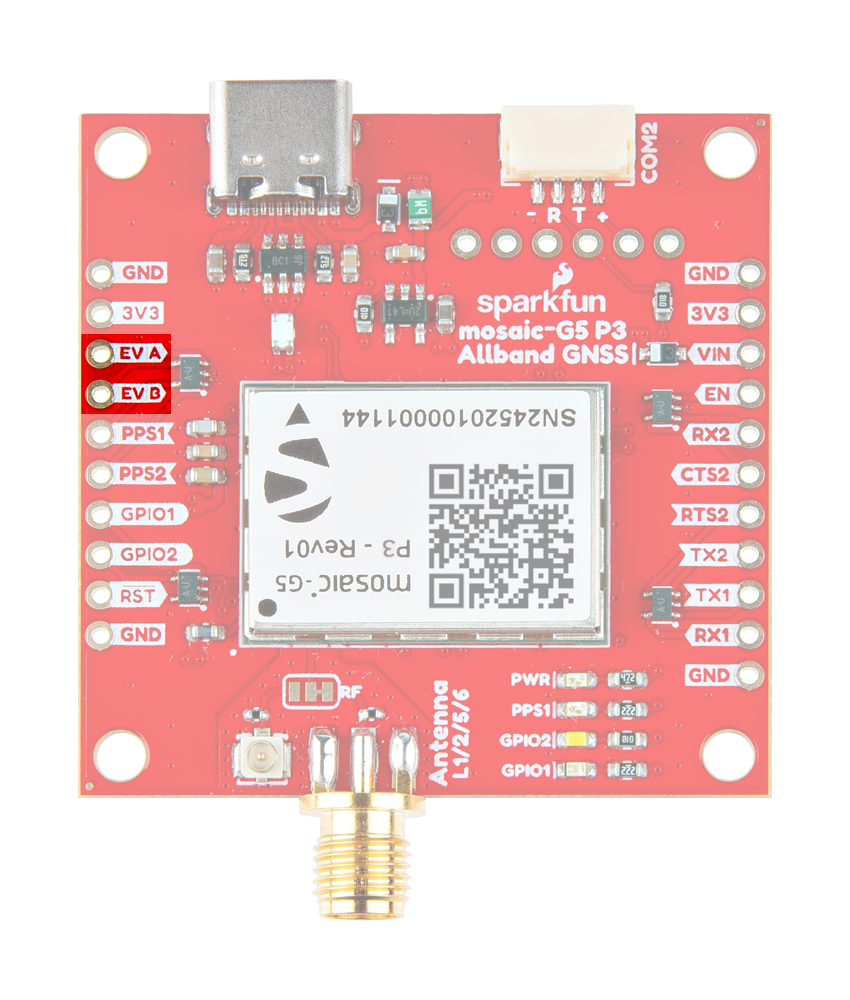{ width="400" }](./assets/img/hookup_guide/event.png "Click to enlarge")
	<figcaption markdown>The event pins on the All-band GNSS RTK breakout board.</figcaption>
	</figure>

	

	

	!!! tip
		To properly detect event triggers:

		- There must be a minimum of 5ms between two events on the same `EVENTx` pin
		- There must be no more than 20 events in any interval of 100ms, on all the `EVENTx` pins

	

	

### BlueSMiRF Header
The All-band GNSS RTK breakout features a 6-pin BlueSMiRF [PTH](https://en.wikipedia.org/wiki/Through-hole_technology "Plated Through Holes") header that is compatible with may of our serial devices (i.e. [UART adapters](https://www.sparkfun.com/categories/349), [*serial* data loggers](https://www.sparkfun.com/categories/589),[BlueSMiRF v2](https://www.sparkfun.com/sparkfun-bluesmirf-v2.html) Bluetooth^&reg;^ serial link, and microcontrollers). Users can access the [`UART2` interface](#uarts) of the mosaic-G5 P3 GNSS receiver through the BlueSMiRF header pins.

<figure markdown>
[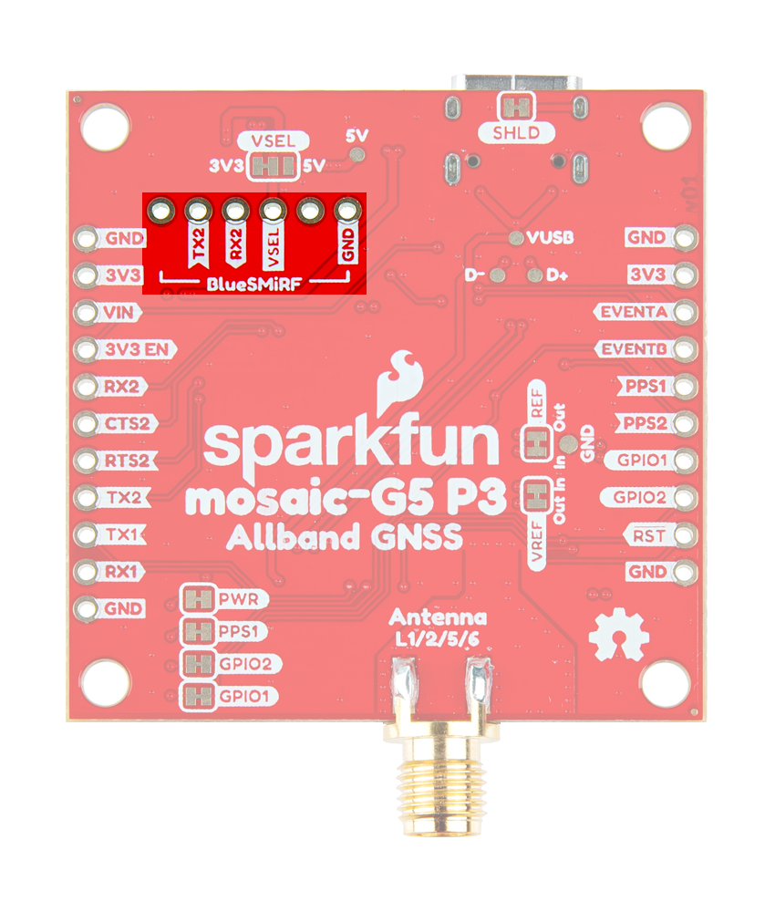{ width="400" }](./assets/img/hookup_guide/headers-bluesmirf.png "Click to enlarge")
<figcaption markdown>The 6-pin BlueSMiRF PTH header on the All-band GNSS RTK breakout board.</figcaption>
</figure>

!!! info
	By default, the UART ports are configured with the following settings:

	- Baudrate: 115200bps
	- Data Bits: 8
	- Parity: No
	- Stop Bits: 1
	- Flow Control: None

	The COM port settings are set with the `setCOMSettings` command.

	!!! tip "`UART2`"
		The `UART2` or `COM2` interface features flow control pins, which are disabled by default. The interface can also be accessed through the [JST connector](#jst-connector) and/or [PTH pins](#uarts).

		!!! warning "Bus Contention"
			To avoid [bus contention](https://en.wikipedia.org/wiki/Bus_contention) issues, make sure only one device is connected to any of these options.

!!! danger "`VSEL` Pin"
	By default, the power pin *(i.e. `VSEL` or Pin 4)* of the BlueSMiRF header is connected to **3.3V** and configured as a power output. An input voltage can be supplied through the pin; however, users should be mindful of any voltage contention issues.

	???+ tip "Jumper"
		By default, the [`VSEL` jumper](#jumpers) is connected to `3V3` pad for a regulated 3.3V output. However, users can modify the jumper to utilize the voltage supplied from either the USB or `VIN` inputs.

### JST Connector
The All-band GNSS RTK breakout features a 4-pin [JST GH connector](./assets/component_documentation/JST-GH_datasheet.pdf), which is polarized and locking. Users can access the [`UART2` interface](#uarts) of the mosaic-G5 P3 GNSS receiver through the JST connector. The JST connector is compatible with external devices, such as the [SiK Telemetry Radio V3](https://www.sparkfun.com/sik-telemetry-radio-v3-915mhz-100mw.html) for RTK corrections using one of our [JST adapter cables](https://www.sparkfun.com/jst-ghr-04v-to-jst-ghr-06v-cable-1-25mm-pitch.html).

<figure markdown>
[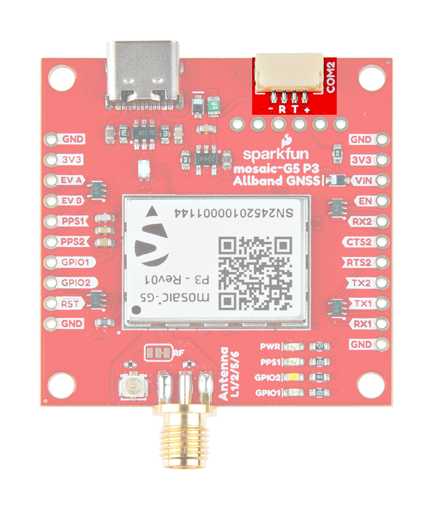{ width="400" }](./assets/img/hookup_guide/jst_connector.png "Click to enlarge")
<figcaption markdown>The JST connector on the All-band GNSS RTK breakout board.</figcaption>
</figure>

!!! info
	By default, the UART ports are configured with the following settings:

	- Baudrate: 115200bps
	- Data Bits: 8
	- Parity: No
	- Stop Bits: 1
	- Flow Control: None

	The COM port settings are set with the `setCOMSettings` command.

	!!! tip "`UART2`"
		The `UART2` or `COM2` interface features flow control pins, which are disabled by default. The interface can also be accessed through the [BlueSMiRF header](#bluesmirf-header) and/or [PTH pins](#uarts).

		!!! warning "Bus Contention"
			To avoid [bus contention](https://en.wikipedia.org/wiki/Bus_contention) issues, make sure only one device is connected to any of these options.

!!! info "Pin Connections"

	

	

	When connecting the All-band GNSS RTK breakout board to other products, users need to be aware of the pin connections between the devices.  and voltage ranges of the products. Below, is a table of the pin connections for the JST connector on the All-band GNSS RTK breakout board.

	<figure markdown>
	[{ width="400" }](./assets/img/hookup_guide/jst_pinout.png "Click to enlarge")
	<figcaption markdown>The pin connections of the JST connector.</figcaption>
	</figure>

	<article style="text-align: center;" markdown>

	<table border="1" markdown>
	<tr>
	<th style="vertical-align:middle;">Pin Number</th>
	<td align="center">
		**1** 
		*(Left Side)*
	</td>
	<td align="center">**2**</td>
	<td align="center">**3**</td>
	<td align="center" markdown>
		**4** 
		*(Right Side)*
	</td>
	</tr>
	<tr>
	<th>Label</th>
	<td align="center">`+`</td>
	<td align="center">`T`</td>
	<td align="center">`R`</td>
	<td align="center">`-`</td>
	</tr>
	<tr>
	<th style="vertical-align:middle;">Function</th>
	<td>
		<u>**Voltage Output**</u> 
		- **Default: 3.3V** 
		- Selectable: 3.3V or 5V
	</td>
	<td align="center" style="vertical-align:middle;">`UART2` - Transmit</td>
	<td align="center" style="vertical-align:middle;">`UART2` - Receive</td>
	<td align="center" style="vertical-align:middle;">Ground</td>
	</tr>
	</table>

	</article>

	

	

	As documented in the [LoRaSerial product manual](https://docs.sparkfun.com/SparkFun_LoRaSerial), the pin connections between a host system and the LoRaSerial Kit radio is outlined in the image below.

	<figure markdown>
	[{ width="400" }](https://docs.sparkfun.com/SparkFun_LoRaSerial/img/SAMD21%20Flow%20control.png "Click to enlarge")
	<figcaption markdown>The `COM` ports on the All-band GNSS RTK breakout board.</figcaption>
	</figure>

	When connecting the All-band GNSS RTK breakout board to our radios, only the `RX`, `TX`, and `GND` connections are required as outlined in the table below. By default, flow control is disabled and the connections are unnecessary.

	<article style="text-align: center;" markdown>

	<table markdown>
	<tr>
	<th>Board</th>
	<td align="center">RX</td>
	<td align="center">TX</td>
	<td align="center">GND</td>
	</tr>
	<tr>
	<th>Radio</th>
	<td align="center">TX</td>
	<td align="center">RX</td>
	<td align="center">GND</td>
	</tr>
	</table>

	</article>

	!!! danger "`VSEL` Pin"
		By default, the power pin *(i.e. `+` or Pin 1)* of the JST connector is connected to **3.3V** and configured as a power output. An input voltage can be supplied through the pin; however, users should be mindful of any voltage contention issues.

		???+ tip "Jumper"
			By default, the [`VSEL` jumper](#jumpers) is connected to `3V3` pad for a regulated 3.3V output. However, users can modify the jumper to utilize the voltage supplied from either the USB or `VIN` inputs.

	

	

## External Antenna
The All-band GNSS RTK breakout board has two options for connecting an external GNSS antenna; the `Antenna L1/2/5/6` U.FL and SMA connectors. These inputs are DC-biased and ESD-protected, so an active antenna can directly be connected without additional components. By default, the SMA connector is the primary interface. In order to utilize the U.FL connector, the `RF` jumper must be modified to redirect the signal path from the SMA connector.

<figure markdown>
[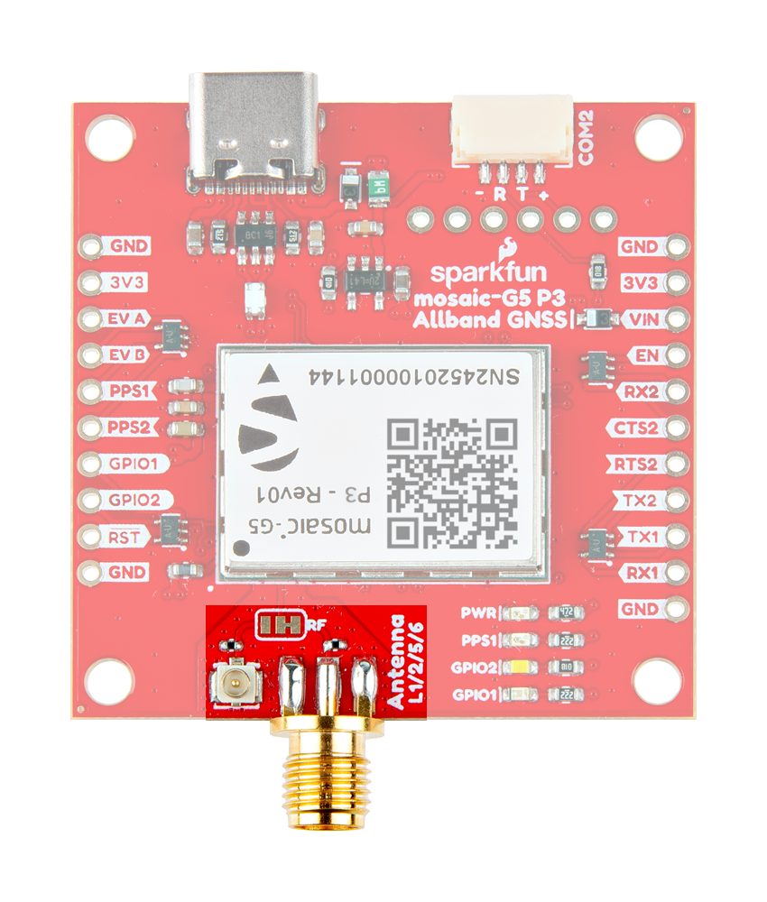{ width="400" }](./assets/img/hookup_guide/antenna.png "Click to enlarge")
<figcaption markdown>The SMA and U.FL connectors to attach a GNSS antenna to the All-band GNSS RTK breakout board.</figcaption>
</figure>

Users will need to connect a compatible GNSS antenna to the `Antenna L1/2/5/6` connector. The type of antenna used with the mosaic-G5 P3 GNSS receiver affects the overall accuracy of the positions calculated by the GNSS receiver.

- An active antenna often features a [LNA](https://en.wikipedia.org/wiki/Low-noise_amplifier "low-noise amplifier"). This allows the GNSS receiver to boost the signal received by the GNSS receiver without degrading the [SNR](https://en.wikipedia.org/wiki/Signal-to-noise_ratio Signal-to-noise ratio).
- The more bands an antenna supports, the greater the performance.
	- Faster acquisition time.
	- Access and support for the `L5` GPS band can potentially mitigate multi-path errors.
	- Supporting more frequency bands, allows a GNSS receiver to be less susceptible to jamming and spoofing.

There are other key parameters related to an antenna that can make or break the signal reception from the satellites. These include, but are not limited to the operation frequency, gain, polarization, efficiency and overall loss.

!!! tip
	For the best performance, we recommend users choose a compatible L1/L2/L5/L6 active GNSS antenna and utilize a low-loss cable. Also, don't forget that GNSS signals are fairly weak and can't penetrate buildings or dense vegetation. The GNSS antenna should have an unobstructed view of the sky.

!!! info
	The `VANT` pin of the GNSS receiver provides external power for an active antenna. By default, this supply voltage is configured at **3.3V**.

	!!! danger
		Never inject an external DC voltage into the RF connection for the GNSS antenna, as it may damage the mosaic-G5 P3 GNSS receiver. For instance, when using a splitter to distribute the antenna signal to several GNSS receivers, make sure that no more than one output of the splitter passes DC. Use [DC-blocks](https://en.wikipedia.org/wiki/DC_block) otherwise.

## Status LEDs

<figure markdown>
[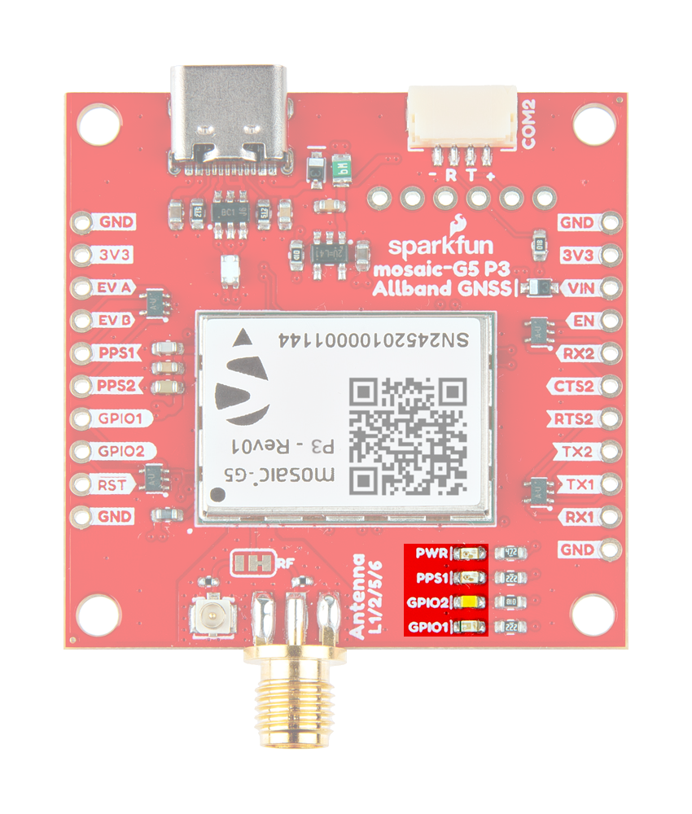{ width="400" }](./assets/img/hookup_guide/LEDs.png "Click to enlarge")
<figcaption markdown>The status indicator LEDs on the All-band GNSS RTK breakout board.</figcaption>
</figure>

There are four status LEDs on the All-band GNSS RTK breakout board:

- `PWR` - Power *(Red)*
	- Turns on once power is supplied through the USB-C connector or `VIN` connections
- `PPS1` - Pulse-Per-Second *(Yellow)*
	- Indicates the pulse-per-second signal from the `PPS1` output *(see the **[PPS Output](#pps-output)** section)*
- `GPIO1` *(Blue)* and `GPIO2` *(White)*
	- These LEDs are controlled through the [GPIO pins](#gpio-pins) and operate based on configured mode

		??? info "LED Behavior"
			The GPIO1` and `GPIO2` LEDs will operate based on the following status modes, which are programmed with the `setGPIO1Mode` and `setGPIO2Mode` commands.

			- `PVTLED`: LED lights when a PVT solution is available.
			- `RTKLED`: LED is off if the PVT is not in RTK mode, blinks in float RTK and is solid on in fixed RTK.
			- `TRACKLED`: Tracked satellites indicator.

				| LED Behaviour | Number of Satellites in Tracking |
				| :------------ | :------------------------------- |
				| Blinks fast and continuously *(10 times per second)* | 0 |
				| Blinks once, then pauses    | 1-2 |
				| Blinks twice, then pauses   | 3-4 |
				| Blinks 3 times, then pauses | 5-6 |
				| Blinks 4 times, then pauses | 7-8 |
				| Blinks 5 times, then pauses | 9+  |

			- `DIFFCORLED`: Differential correction indicator.

				- In rover PVT mode, this LED reports the number of satellites for which differential corrections have been provided in the last received differential correction message (RTCM or CMR).

					| LED Behaviour | Number of Satellites w/ Corrections |
					| :------------ | :---------------------------------- |
					| LED Off | No differential correction message received |
					| Blinks fast and continuously *(10 times per second)* | 0 |
					| Blinks once, then pauses    | 1-2 |
					| Blinks twice, then pauses   | 3-4 |
					| Blinks 3 times, then pauses | 5-6 |
					| Blinks 4 times, then pauses | 7-8 |
					| Blinks 5 times, then pauses | 9+  |

				- If the corrections are received from geostationary satellites over the L-band, the LED will be on for about 1 second, then blink fast twice.

## Jumpers

??? note "Never modified a jumper before?"
	Check out our <a href="https://learn.sparkfun.com/tutorials/664">Jumper Pads and PCB Traces tutorial</a> for a quick introduction!

	

	-  <a href="https://learn.sparkfun.com/tutorials/664">
		<figure markdown>
		
		</figure>

		---

		**How to Work with Jumper Pads and PCB Traces**</a>

	

There are nine jumpers on the board that can be used to easily modify the hardware connections on the board.

<figure markdown>
[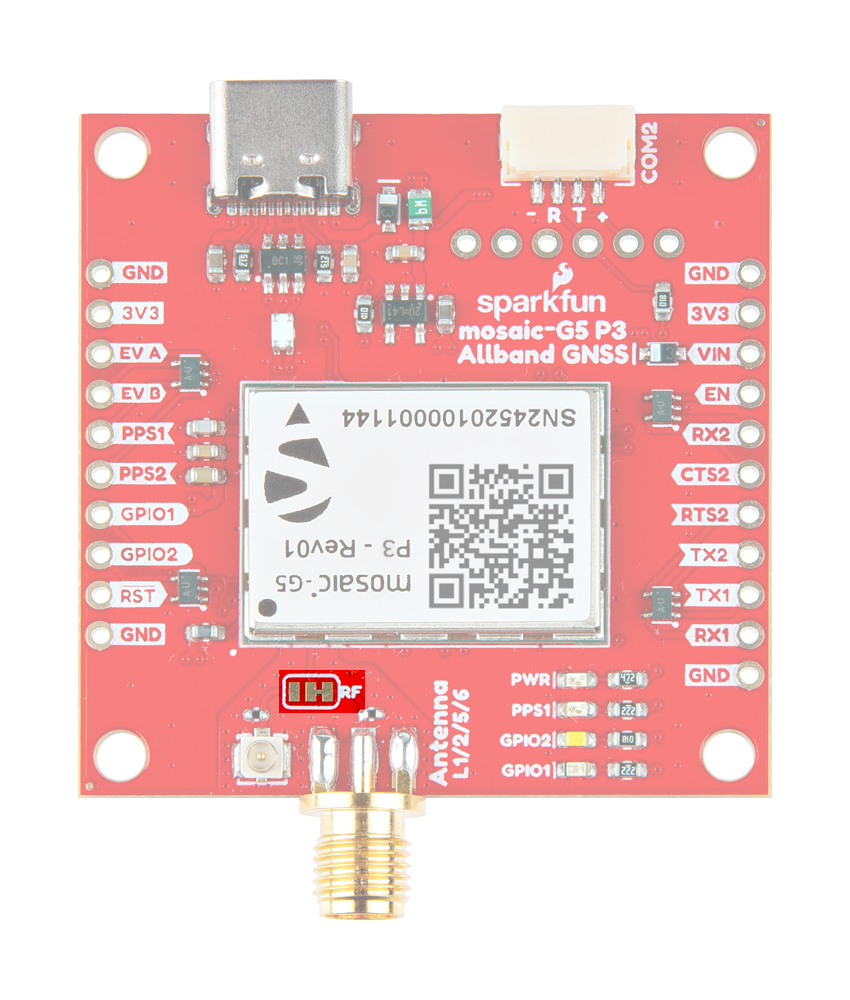{ width="400" }](./assets/img/hookup_guide/jumpers-top.png "Click to enlarge")
<figcaption markdown>The jumper on the top of the All-band GNSS RTK breakout board.</figcaption>
</figure>

<figure markdown>
[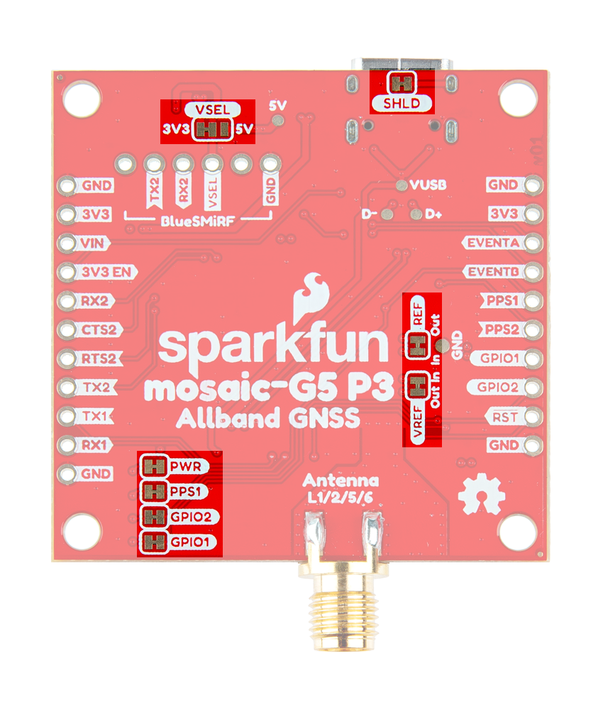{ width="400" }](./assets/img/hookup_guide/jumpers-bottom.png "Click to enlarge")
<figcaption markdown>The jumpers on the back of the All-band GNSS RTK breakout board.</figcaption>
</figure>

=== "Antenna Input"
	**`RF`**
	:   This jumper can be modified to configure the RF input, for the external GNSS antenna, between the SMA and U.FL connectors.

	!!! info
		By default, the jumper is configured to utilize the SMA connector.

=== "Power"
	**`VSEL`**
	:   This jumper can be modified to configure/disconnect the `VCC` pin of the [4-pin locking JST connector](#jst-connector) and [BlueSMiRF header](#bluesmirf-header) to/from `3V3` or `5V` power.

		!!! info
			By default, the jumper is configured to supply 3.3V from the All-band GNSS RTK breakout board.

	**`SHLD`**
	:   This jumper can be cut to disconnect the shield of the USB-C connector from the board's ground plane.

=== "LED Power"
	There are four jumpers that control power to the [status LEDs](#status-leds) on the board.

	- **`PWR`** - This jumper can be cut to remove power from the red, power LED.
	- **`PPS1`** - This jumper can be cut to remove power from the yellow LED, which is connected to the [PPS](https://en.wikipedia.org/wiki/Pulse-per-second_signal "Pulse Per Second") signal.
	- **`GPIO2`** - This jumper can be cut to remove power from the white LED that is connected to the `GPIO2` pin.
	- **`GPIO1`** - This jumper can be cut to remove power from the blue LED that is connected to the `GPIO1` pin.

	!!! info
		By default, all the jumpers are connected, to power the status LEDs. For low power applications, users can cut the jumpers to disconnect power from each of the LEDs.

=== "Timing"
	**`VREF`**
	:   Controls the reference voltage for the internal TXCO

		- `In` - Voltage input for the internal TXCO
		- `Out` - Reference voltage to power the internal TXCO

	**`REF`**
	:   Controls the reference clock signal

		- `In` - Reference clock signal input
		- `Out` - 10-MHz signal from the internal TCXO

