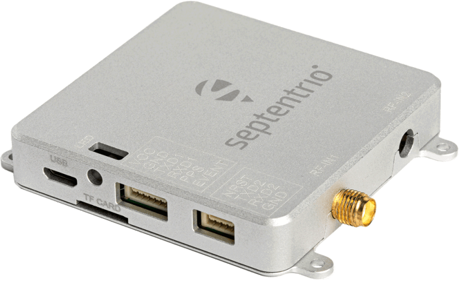
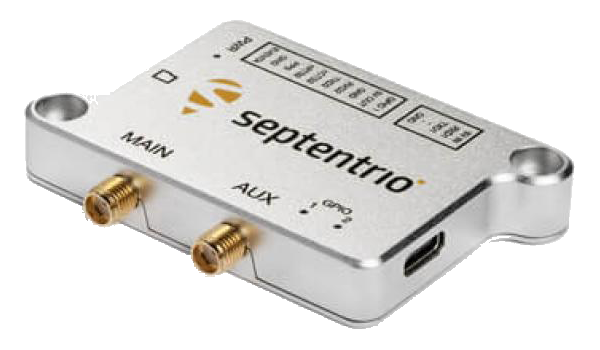
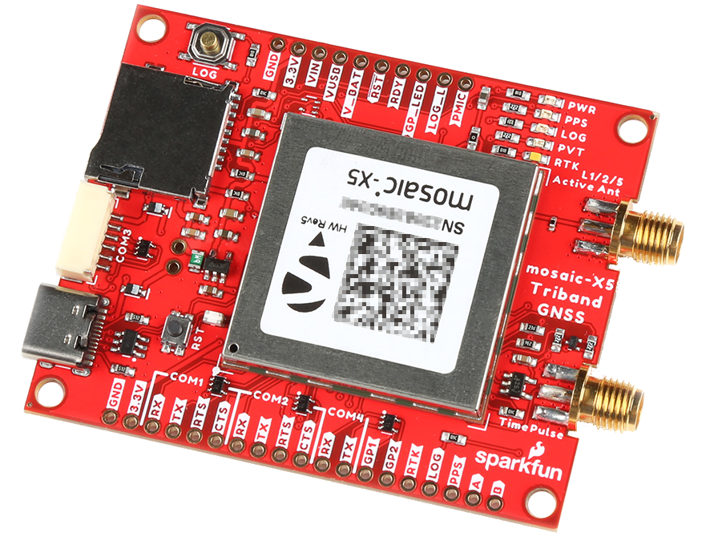
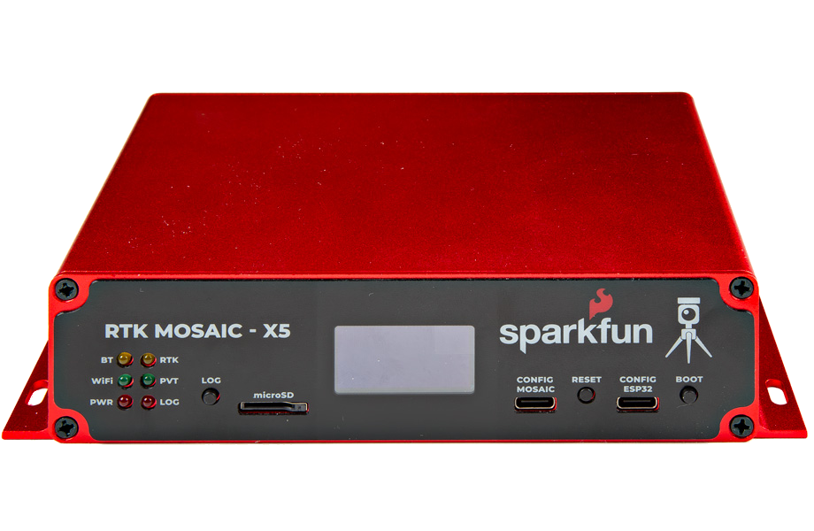

!!! danger  "Important: Read Before Use!"
	!!! warning "ESD Sensitivity"
		The mosaic-G5 P3 GNSS receiver is sensitive to [ESD](https://en.wikipedia.org/wiki/Electrostatic_discharge "Electrostatic Discharge"). Use a proper grounding system to make sure that the working surface and the components are at the same electric potential.

		??? info
			As recommended by the manufacturer, we highly recommend that users take the necessary precautions to avoid damaging their GNSS receiver.

			- The All-band GNSS RTK breakout board features ESD protection on the USB-C connector and breakout pins:
				- USB data lines
				- I/O PTH pads
				- JST connector and BlueSMiRF header pins
			- The mosaic-G5 P3 GNSS receiver features internal ESD protection to the `ANT_1` antenna input.

			

			<iframe src="https://www.youtube.com/embed/hrL5J6Q5gX8?si=jOPBat8rzMnL7Uz4&amp;start=26;&amp;end=35;" title="Septentrio: Getting Started Video (playback starts at ESD warning)" frameborder="0" allow="accelerometer; autoplay; clipboard-write; encrypted-media; gyroscope; picture-in-picture" allowfullscreen></iframe>
			

	!!! warning "Active Antenna"
		Never inject an external DC voltage into the SMA connector for the GNSS antenna, as it may damage the mosaic-G5 P3 GNSS receiver. For instance, when using a splitter to distribute the antenna signal to several GNSS receivers, make sure that no more than one output of the splitter passes DC. Use [DC-blocks](https://en.wikipedia.org/wiki/DC_block) otherwise.

# Introduction

-   <a href="https://www.sparkfun.com/sparkfun-allband-gnss-rtk-breakout-mosaic-g5-p3.html">
	**mosaic-G5 P3 GNSS Breakout** 
	**SKU:** GPS-29208

	---

	<figure markdown>
	
	</figure></a>

	<article style="text-align: center;" markdown>
	[Purchase from SparkFun :fontawesome-solid-cart-plus:{ .heart }](https://www.sparkfun.com/sparkfun-allband-gnss-rtk-breakout-mosaic-g5-p3.html){ .md-button .md-button--primary }
	{ .tinyqr }
	</article>

-   This SparkFun Allband GNSS RTK Breakout features the Septentrio mosaic-G5 P3 GNSS receiver, a 60% smaller and 40% lower power consumption variant of the mosaic-X5 GNSS receiver, making it ideal for drone and IoT applications. The receiver supports the GPS (USA), GLONASS (Russia), Beidou (China), Galileo (Europe), and QZSS (Japan) GNSS constellations, including regional systems *(i.e. SBAS)*. With its Real-Time Kinematics (RTK) capabilities, the GNSS receiver can achieve a horizontal accuracy of 6mm (~0.25in), vertical accuracy of 1cm (~0.4in), PPS timing resolution of 1.4ns (1.4 billionths of a second), and event trigger accuracy below 3ns. It also features Septentrio's unique [AIM+ technology](https://www.septentrio.com/en/learn-more/advanced-positioning-technology/aim-jamming-protection) for interference mitigation and anti-spoofing, ensuring best-in-class reliability and scalable position accuracy.

	The mosaic-G5 P3 GNSS receiver supports USB 2.0 communication and two UART interfaces; along with two GPIO, two configurable PPS outputs, and two event trigger input pins. Users can control and configure the GNSS receiver through a command-line interface (CLI) using the Septentrio Binary Format (SBF), NMEA, and RTCM v3.x protocols. Otherwise, users can also configure the GNSS receiver with Septentrio's [RxTools software application](https://www.septentrio.com/en/products/gps-gnss-receiver-software/rxtools). On the board, the `UART2` interface is also broken out to a locking JST connector and BlueSMiRF PTH header pins to attach an RF transceiver for RTK corrections.

??? question "Product Comparison: GNSS Products"
	Below is a simple comparison table between our breakout board and Septentrio's development and evaluation kits:

	

	<table markdown>
	<tr markdown>
		<td markdown></td>
		<th markdown style="text-align:center">
			mosaic-X5 Development Kit 
			

			<figure markdown>
			{ width="200" }
			</figure>
		</th>
		<th markdown style="text-align:center">
			mosaic-go X5 Evaluation Kit 
			

			<figure markdown>
			{ width="200" }
			</figure>
		</th>
		<th markdown style="text-align:center">
			mosaic-go G5 Evaluation Kit 
			

			<figure markdown>
			{ width="200" }
			</figure>
		</th>
		<th markdown style="text-align:center">
			mosaic-X5 GNSS Breakout 
			

			<figure markdown>
			{ width="200" }
			</figure>
		</th>
		<th markdown style="text-align:center">
			RTK mosaic-X5 
			

			<figure markdown>
			{ width="200" }
			</figure>
		</th>
		<th markdown style="text-align:center">
			SparkPNT RTK Facet mosaic 
			

			<figure markdown>
			{ width="200" }
			</figure>
		</th>
		<th markdown style="text-align:center">
			mosaic-G5 P3 GNSS Breakout 
			

			<figure markdown>
			{ width="200" }
			</figure>
		</th>
		<th markdown style="text-align:center">
			mosaic-X5 Flex Module 
			

			<figure markdown>
			{ width="200" }
			</figure>
		</th>
		<th markdown style="text-align:center">
			mosaic-X5 +IM19 Flex Module 
			

			<figure markdown>
			{ width="200" }
			</figure>
		</th>
		<th markdown style="text-align:center">
			mosaic-G5 P3 Flex Module 
			+ IM19 IMU *(optional)* 
			

			<figure markdown>
			{ width="200" }
			</figure>
		</th>
	</tr>
	<tr>
		<td style="vertical-align:middle;">GNSS Antenna</td>
		<td style="text-align:center; vertical-align:middle;">Dual</td>
		<td style="text-align:center">
			1 - X5 
			2 - H
		</td>
		<td style="text-align:center">
			2 - G5 P3* 
			2 - G5 T* 
			2 - G5 P3H
		</td>
		<td style="text-align:center; vertical-align:middle;">1</td>
		<td style="text-align:center; vertical-align:middle;">1</td>
		<td style="text-align:center; vertical-align:middle;">Integrated</td>
		<td style="text-align:center; vertical-align:middle;">1</td>
		<td style="text-align:center; vertical-align:middle;">1</td>
		<td style="text-align:center; vertical-align:middle;">1</td>
		<td style="text-align:center; vertical-align:middle;">1</td>
	</tr>
	<tr>
		<td markdown>USB Connector</td>
		<td style="text-align:center">micro-B</td>
		<td style="text-align:center">micro-B</td>
		<td style="text-align:center">Type-C</td>
		<td style="text-align:center">Type-C</td>
		<td style="text-align:center">Type-C</td>
		<td style="text-align:center">Type-C</td>
		<td style="text-align:center">Type-C</td>
		<td style="text-align:center">N/A*</td>
		<td style="text-align:center">N/A*</td>
		<td style="text-align:center">Type-C</td>
	</tr>
	<tr>
		<td style="vertical-align:middle;">Ethernet</td>
		<td style="text-align:center">Yes</td>
		<td style="text-align:center">No</td>
		<td style="text-align:center">No</td>
		<td style="text-align:center">No</td>
		<td style="text-align:center">Yes</td>
		<td style="text-align:center">No</td>
		<td style="text-align:center">No</td>
		<td style="text-align:center">2x10 Header*</td>
		<td style="text-align:center">No</td>
		<td style="text-align:center">No</td>
	</tr>
	<tr>
		<td style="vertical-align:middle;">WiFi</td>
		<td style="text-align:center">No</td>
		<td style="text-align:center">No</td>
		<td style="text-align:center">No</td>
		<td style="text-align:center">No</td>
		<td style="text-align:center">Yes</td>
		<td style="text-align:center">Yes</td>
		<td style="text-align:center">No</td>
		<td style="text-align:center">No</td>
		<td style="text-align:center">No</td>
		<td style="text-align:center">No</td>
	</tr>
	<tr>
		<td style="vertical-align:middle;">COM Ports</td>
		<td style="text-align:center">4</td>
		<td style="text-align:center">2</td>
		<td style="text-align:center">2</td>
		<td style="text-align:center">4</td>
		<td style="text-align:center">
			1 - mosaic-X5 
			1 - ESP32
		</td>
		<td style="text-align:center">
			1 - mosaic-X5 
			1 - ESP32
		</td>
		<td style="text-align:center">2</td>
		<td style="text-align:center">4</td>
		<td style="text-align:center">
			2 - mosaic-X5 
			2 - IM19 IMU
		</td>
		<td style="text-align:center">
			2 - mosaic-G5 
			2 - IM19 IMU*
		</td>
	</tr>
	<tr>
		<td markdown>&micro;SD Card Slot</td>
		<td style="text-align:center">Yes</td>
		<td style="text-align:center">Yes</td>
		<td style="text-align:center">Yes*</td>
		<td style="text-align:center">Yes</td>
		<td style="text-align:center">Yes</td>
		<td style="text-align:center">Yes</td>
		<td style="text-align:center">No</td>
		<td style="text-align:center">2x10 Header*</td>
		<td style="text-align:center">2x10 Header*</td>
		<td style="text-align:center">No</td>
	</tr>
	<tr>
		<td style="vertical-align:middle;">Reset/Log Buttons</td>
		<td style="text-align:center; vertical-align:middle;">Yes</td>
		<td style="text-align:center; vertical-align:middle;">No*</td>
		<td style="text-align:center; vertical-align:middle;">No*</td>
		<td style="text-align:center; vertical-align:middle;">Yes</td>
		<td style="text-align:center; vertical-align:middle;">Yes</td>
		<td style="text-align:center; vertical-align:middle;">Yes</td>
		<td style="text-align:center; vertical-align:middle;">No</td>
		<td style="text-align:center; vertical-align:middle;">No</td>
		<td style="text-align:center; vertical-align:middle;">No</td>
		<td style="text-align:center; vertical-align:middle;">No</td>
	</tr>
	<tr>
		<td style="vertical-align:middle;">Logic-Level</td>
		<td style="text-align:center">
			1.8V 
			3.3V
		</td>
		<td style="text-align:center; vertical-align:middle;">3.3V</td>
		<td style="text-align:center; vertical-align:middle;">3.3V</td>
		<td style="text-align:center; vertical-align:middle;">3.3V</td>
		<td style="text-align:center">
			3.3V 
			5V
		</td>
		<td style="text-align:center; vertical-align:middle;">3.3V</td>
		<td style="text-align:center; vertical-align:middle;">3.3V</td>
		<td style="text-align:center; vertical-align:middle;">3.3V</td>
		<td style="text-align:center; vertical-align:middle;">3.3V</td>
		<td style="text-align:center; vertical-align:middle;">3.3V</td>
	</tr>
	<tr>
		<td markdown>PPS Signal</td>
		<td style="text-align:center">Header Pin</td>
		<td style="text-align:center">6-Pin JST Connector</td>
		<td style="text-align:center">Header Pin</td>
		<td style="text-align:center">SMA Connector</td>
		<td style="text-align:center">Screw Terminal</td>
		<td style="text-align:center">No</td>
		<td style="text-align:center">Header Pin</td>
		<td style="text-align:center">2x10 Header*</td>
		<td style="text-align:center">2x10 Header*</td>
		<td style="text-align:center">2x10 Header*</td>
	</tr>
	<tr>
		<td markdown>Enclosure Material</td>
		<td style="text-align:center; vertical-align:middle;">N/A</td>
		<td style="text-align:center; vertical-align:middle;">Metal</td>
		<td style="text-align:center; vertical-align:middle;">Metal</td>
		<td style="text-align:center; vertical-align:middle;">N/A</td>
		<td style="text-align:center; vertical-align:middle;">Aluminum</td>
		<td style="text-align:center; vertical-align:middle;">Plastic</td>
		<td style="text-align:center; vertical-align:middle;">N/A</td>
		<td style="text-align:center; vertical-align:middle;">N/A</td>
		<td style="text-align:center; vertical-align:middle;">N/A</td>
		<td style="text-align:center; vertical-align:middle;">N/A</td>
	</tr>
	<tr>
		<td style="vertical-align:middle;">Dimensions</td>
		<td style="text-align:center; vertical-align:middle;">N/A</td>
		<td style="text-align:center; vertical-align:middle;">71.0 x 59.0 x 12.0mm ± 1mm</td>
		<td style="text-align:center; vertical-align:middle;">74.0 x 44.0 x 11.4mm</td>
		<td style="text-align:center; vertical-align:middle;">70.9 x 50.8 x 8mm</td>
		<td style="text-align:center">
			180.6 x 101.8 x 41mm 
			<i>Enclosure Only</i>
		</td>
		<td style="text-align:center; vertical-align:middle;"></td>
		<td style="text-align:center; vertical-align:middle;">43.2 x 43.2 x 8mm</td>
		<td style="text-align:center; vertical-align:middle;">44.0 x 34.0 x 10.4mm</td>
		<td style="text-align:center; vertical-align:middle;">44.0 x 34.0 x 10.4mm</td>
		<td style="text-align:center; vertical-align:middle;">44.0 x 34.0 x 8.5mm</td>
	</tr>
	<tr>
		<td style="vertical-align:middle;">Weight</td>
		<td style="text-align:center; vertical-align:middle;">N/A</td>
		<td style="text-align:center; vertical-align:middle;">58g  ± 1g</td>
		<td style="text-align:center; vertical-align:middle;">50g</td>
		<td style="text-align:center; vertical-align:middle;">22.60g</td>
		<td style="text-align:center; vertical-align:middle;">
			415.15g 
			<i>Enclosure Only</i>
		</td>
		<td style="text-align:center; vertical-align:middle;"></td>
		<td style="text-align:center; vertical-align:middle;">11.15g</td>
		<td style="text-align:center; vertical-align:middle;">14.00g</td>
		<td style="text-align:center; vertical-align:middle;">15.25g</td>
		<td style="text-align:center; vertical-align:middle;">
			- IMU: 9.20g 
			+ IMU: 10.95g
		</td>
	</tr>

	</table>

	

	!!! note "mosaic-go Evaluation Kits"
		- For the mosaic-X5 and mosaic-H, the reset pin is exposed on 4-pin JST connector and the log pin is connected to the latch pin of the SD card slot.
		- For the mosaic-G5 P3/T/H, the reset pin is exposed on a header pin. There is no log pin, data logging must be enabled through a command set. Logging to internal disk (`DSK1`) is only for debugging purposes, feature is prone to [data gaps during operation](https://customersupport.septentrio.com/s/article/mosaic-G5-logging-data-on-G5).

	!!! note "mosaic GNSS Flex Modules"
		SparkPNT GNSS Flex modules are modular, *plug-in* boards that utilize a *carrier* board to access the pins of the GNSS Flex headers.

		- The USB, SD card, and Ethernet interfaces and PPS signals are exposed through the 2x10 header pins.
		- For the GNSS Flex modules with an optional IMU, the last two COM ports are reserved for the IM19 IMU.

??? question "Product Comparison: mosaic-G5 Modules"
	The variants of the mosaic-G5 product family offer diverse capabilities tailored for specific applications, primarily focusing on new use cases within ground robotics, UAV, and other scenarios requiring a small form factor without compromising performances.

	- The triple-band mosaic-G5 P1 offers entry-level, high-performance positioning that is ideal for high-volume applications such as inspection drones or robotic mowers.
	- The All-band mosaic-G5 P3 and P3H bring strong positioning reliability in challenging environments and are tailored for applications such as delivery or light show drones.
		- P3H: The mosaic-G5 P3H can calculate heading with a uniquely small baseline distance between its two GNSS antennas, providing accurate navigation for small autonomous devices.
	- The multi-band mosaic-G5 T provides clock and frequency synchronization with nano-second accuracy. It also features Septentrio's AIM+ Premium technology for enhanced jamming and spoofing protection for additional resilience.

	

	<table markdown>
	<tbody markdown>
	<tr markdown>
		<th markdown>Features</td>
		<th colspan="4" rowspan="1" style="text-align:center;" markdown>mosaic-G5 Product Family</td>
	</tr>
	<tr style="break-inside: avoid;" markdown>
		<td markdown>Variants</td>
		<td style="text-align:center;" markdown>**mosaic-G5 P1**</td>
		<td style="text-align:center;" markdown>**mosaic-G5 P3**</td>
		<td style="text-align:center;" markdown>**mosaic-G5 P3H**</td>
		<td style="text-align:center;" markdown>**mosaic-G5 T**</td>
	</tr>
	<tr style="break-inside: avoid;" markdown>
		<td style="vertical-align:middle;" markdown>
			Constellation 
			Frequency Bands
		</td>
		<td valign="top" markdown>
			**3 - L1, L2, L5** (incl B3I)
			<li>GPS: L1C/A, L1C, L2C, L2PY, L5</li>
			<li>Glonass: L1C/A, L2C/A, L2P, L3OC</li>
			<li>Beidou: B1I, B1C, B2a, B2I, B3I</li>
			<li>Galileo: E1, E5a, E5b</li>
			<li>QZSS: L1, L2, L5</li>
		</td>
		<td valign="top" markdown>
			**4 - L1, L2, L5, E6** (incl B3I)
			<li>GPS: L1C/A, L1C, L2C, L2PY, L5</li>
			<li>Glonass: L1C/A, L2C/A, L2P, L3OC</li>
			<li>Beidou: B1I, B1C, B2a, B2I, B3I</li>
			<li>Galileo: E1, E5a, E5b, **E6BC**</li>
			<li>QZSS: L1, L2, L5, **L6**</li>
			<li>NavIC: L5*</li>
		</td>
		<td valign="top" markdown>
			**4 - L1, L2, L5, E6** (incl B3I)*
			<li>GPS: L1C/A, L1C, L2C, L2PY, L5</li>
			<li>Glonass: L1C/A, L2C/A, L2P, L3OC</li>
			<li>Beidou: B1I, B1C, B2a, B2I, B3I</li>
			<li>Galileo: E1, E5a, E5b, **E6BC**</li>
			<li>QZSS: L1, L2, L5, **L6**</li>
			<li>NavIC: L5*</li>
		</td>
		<td valign="top" markdown>
			**5 - L1, L2, L5, E6/L6, L-Band**
			<li>GPS: L1C/A, L1C, L2C, L2PY, L5</li>
			<li>Glonass: L1C/A, L2C/A, L2P, L3OC</li>
			<li>Beidou: B1I, B1C, B2a, B2I, B3I, **B2B**</li>
			<li>Galileo: E1, E5a, E5b, **E6BC**</li>
			<li>QZSS: L1, L2, L5, **L6**</li>
			<li>NavIC: L5*</li>
			<li>L-Band</li>
		</td>
	</tr>
	<tr style="break-inside:avoid;" markdown>
		<td style="vertical-align:middle;" markdown>Robustness & Resilience</td>
		<td valign="top" markdown>
			<li>Manual anti-jamming, no auto-mitigation</li>
			<li>Anti-spoofing detection</li>
			<li>Anti-jamming detection</li>
			<li>IONO indicator</li>
		</td>
		<td valign="top" markdown>
			<li>**OSNMA**</li>
			<li>**Automatic** anti-jamming, mitigation **Class 1**</li>
			<li>Anti-spoofing detection and mitigation</li>
			<li>IONO indicator and mitigation</li>
		</td>
		<td valign="top" markdown>
			<li>**OSNMA**</li>
			<li>**Automatic** anti-jamming, mitigation **Class 1**</li>
			<li>Anti-spoofing detection and mitigation</li>
			<li>IONO indicator and mitigation</li>
		</td>
		<td valign="top" markdown>
			<li>**OSNMA**</li>
			<li>**Automatic** anti-jamming, mitigation **Class 2**</li>
			<li>Anti-spoofing detection and mitigation</li>
		</td>
	</tr>
	<tr style="break-inside: avoid;" markdown>
		<td markdown>Heading - Dual Antenna</td>
		<td markdown>No</td>
		<td markdown>No</td>
		<td markdown>**Yes**</td>
		<td markdown>No</td>
	</tr>
	<tr style="break-inside: avoid;" markdown>
		<td style="vertical-align:middle;" markdown>RTK</td>
		<td style="vertical-align:middle;" markdown>Rover only (no base)</td>
		<td markdown>
			Rover only 
			(Base Station*)
		</td>
		<td markdown>
			Rover only 
			(Base Station*)
		</td>
		<td style="vertical-align:middle;" markdown>No</td>
	</tr>
	<tr style="break-inside: avoid;" markdown>
		<td markdown>PPP / MCPPAR</td>
		<td markdown>No</td>
		<td markdown>No</td>
		<td markdown>No</td>
		<td markdown>No</td>
	</tr>
	<tr style="break-inside: avoid;" markdown>
		<td markdown>Galileo HAS</td>
		<td markdown>No</td>
		<td markdown>**Yes***</td>
		<td markdown>**Yes***</td>
		<td markdown>**Yes***</td>
	</tr>
	<tr style="break-inside: avoid;" markdown>
		<td markdown>Raw Data</td>
		<td markdown>No</td>
		<td markdown>**Yes**</td>
		<td markdown>No</td>
		<td markdown>No</td>
	</tr>
	<tr style="break-inside: avoid;" markdown>
		<td markdown>Events</td>
		<td markdown>No</td>
		<td markdown>**Yes**</td>
		<td markdown>**Yes**</td>
		<td markdown>**Yes**</td>
	</tr>
		<tr style="break-inside: avoid;" markdown>
		<td markdown>Moving Base</td>
		<td markdown>No</td>
		<td markdown>**Yes***</td>
		<td markdown>**Yes***</td>
		<td markdown>No</td>
	</tr>
	<tr style="break-inside: avoid;" markdown>
		<td markdown>Data Rate</td>
		<td markdown>5 Hz</td>
		<td markdown>20 Hz</td>
		<td markdown>20 Hz</td>
		<td markdown>5 Hz</td>
	</tr>
	<tr style="break-inside: avoid;" markdown>
		<td markdown>Time and Frequency Sync</td>
		<td style="vertical-align:middle;" markdown>No</td>
		<td style="vertical-align:middle;" markdown>No</td>
		<td style="vertical-align:middle;" markdown>No</td>
		<td style="vertical-align:middle;" markdown>**Yes**</td>
	</tr>
	<tr style="break-inside: avoid;" markdown>
		<td markdown>Evaluation kit</td>
		<td markdown>No</td>
		<td markdown>**Yes**</td>
		<td markdown>**Yes**</td>
		<td markdown>**Yes**</td>
	</tr>
	</tbody>
	</table>

	Source: [mosaic-G5: Product variant differentiation (P1/P3/P3H)](https://customersupport.septentrio.com/s/article/mosaic-G5-Variant-differentiation)

	

	`*`: Roadmap items

In this guide we'll cover how to setup the mosaic-G5 P3 GNSS breakout board. To follow along with this tutorial, at a minimum, users will need the following items:

- Computer with an operating system (OS) that is compatible with all the software installation requirements (1)

	!!! warning "Software Compatibility"
		The [RxTools software suite](https://www.septentrio.com/en/products/gps-gnss-receiver-software/rxtools) from Septentrio, provides users with an interface for the receiver configuration, monitoring, data logging, and analysis. However, it only appears to be available for Windows and Linux operating systems.

- [USB 3.1 Cable A to C - 3 Foot](https://www.sparkfun.com/usb-3-1-cable-a-to-c-3-foot.html) - Used to interface with the mosaic-G5 P3 GNSS Breakout (2)
- [SparkFun All-band GNSS RTK Breakout - mosaic-G5 P3](https://www.sparkfun.com/sparkfun-allband-gnss-rtk-breakout-mosaic-g5-p3.html)
- GNSS Multi-Band Antenna (3)
	- [GNSS Multi-Band Helical Antenna](https://www.sparkfun.com/gnss-multi-band-l1-l2-l5-helical-antenna-locking-sma.html)
		- [SMA Female to SMA Male Cable](https://www.sparkfun.com/interface-cable-sma-female-to-sma-male-10m-rg58.html)
	- [GNSS Multi-Band Surveying Antenna](https://www.sparkfun.com/gnss-multi-band-l1-l2-l5-surveying-antenna-tnc-spk6618h.html)
		- [SMA Male to TNC Male Cable](https://www.sparkfun.com/reinforced-interface-cable-sma-male-to-tnc-male-10m.html)
		- [Antenna Mount](https://www.sparkfun.com/gnss-magnetic-antenna-mount-5-8-11-tpi.html)

1. A list of the compatible GNSS receiver software, is provided on the [Septentrio website](https://www.septentrio.com/en/products/gps-gnss-receiver-software).
2. If your computer doesn't have a USB-A slot, then choose an appropriate cable or adapter.
3. For the best performance, use a compatible L1/L2/L5/L6 GNSS antenna.

-   <a href="https://www.sparkfun.com/usb-3-1-cable-a-to-c-3-foot.html">
	<figure markdown>
	
	</figure>

	---

	**USB 3.1 Cable A to C - 3 Foot** 
	CAB-14743</a>

-   <a href="https://www.sparkfun.com/sparkfun-allband-gnss-rtk-breakout-mosaic-g5-p3.html">
	<figure markdown>
	
	</figure>

	---

	**Allband GNSS RTK Breakout mosaic-G5 P3** 
	GPS-29208</a>

-   <a href="https://www.sparkfun.com/gnss-multi-band-l1-l2-l5-helical-antenna-locking-sma.html">
	<figure markdown>
	
	</figure>

	---

	**GNSS Multi-Band L1/L2/L5 Helical Antenna (Locking SMA)** 
	GPS-30249</a>

-   <a href="https://www.sparkfun.com/interface-cable-sma-female-to-sma-male-10m-rg58.html">
	<figure markdown>
	
	</figure>

	---

	**Interface Cable - SMA Female to SMA Male (10m, RG58)** 
	CAB-21281</a>

-   <a href="https://www.sparkfun.com/gnss-multi-band-l1-l2-l5-surveying-antenna-tnc-spk6618h.html">
	<figure markdown>
	
	</figure>

	---

	**GNSS Multi-Band L1/L2/L5/L6 Surveying Antenna - TNC (SPK6618H)** 
	GPS-21801</a>

-   <a href="https://www.sparkfun.com/reinforced-interface-cable-sma-male-to-tnc-male-10m.html">
	<figure markdown>
	
	</figure>

	---

	**Reinforced Interface Cable - SMA Male to TNC Male (10m)** 
	CAB-21740</a>

-   <a href="https://www.sparkfun.com/gnss-magnetic-antenna-mount-5-8-11-tpi.html">
	<figure markdown>
	
	</figure>

	---

	**GNSS Magnetic Antenna Mount - 5/8" 11-TPI** 
	PRT-21257</a>

!!! danger "ESD Protection"
	The Septentrio mosaic-G5 P3 GNSS receiver is sensitive to [ESD](https://en.wikipedia.org/wiki/Electrostatic_discharge "Electrostatic Discharge"). Use a proper grounding system to make sure that the working surface and the components are at the same electric potential.

	<article class="video-500px" style="margin: auto;" markdown>
	<iframe src="https://www.youtube.com/embed/hrL5J6Q5gX8?si=jOPBat8rzMnL7Uz4&amp;start=26;&amp;end=35;" title="Septentrio: Getting Started Video (playback starts at ESD warning)" frameborder="0" allow="accelerometer; autoplay; clipboard-write; encrypted-media; gyroscope; picture-in-picture" allowfullscreen></iframe>
	</article>

	!!! warning
		As recommended by the manufacturer, we highly recommend that users take the necessary precautions to avoid damaging their GNSS receiver.

## Section Topics
This guide is divided into three sections:

- The **Quickstart Guide** assumes a working knowledge of GNSS receiver, development boards, and the required software to program and/or configure them for your project's needs. It only covers basic hardware information and assembly instructions users would need to get started with this product.
- The **Hardware** section has two sub-sections that provide:
	- An overview of the board's design, major components, and interfaces. Refer to this page for information on the connectors, breakout pins, and jumpers.
	- Assembly instructions for this product's interfaces.
- The **Software** section has several sub-sections. The mosaic-G5 P3 GNSS receiver has numerous capabilities and a multitude of ways to configure and interface with them.
- In the **Resources** and **Support** sections, users can find the design files (KiCad files & schematic), relevant documentation (datasheets, white papers, etc.) and other helpful links on the Resources page. Lastly, the **Troubleshooting Tips** page includes helpful tips and instructions for how to receive technical support from SparkFun.
